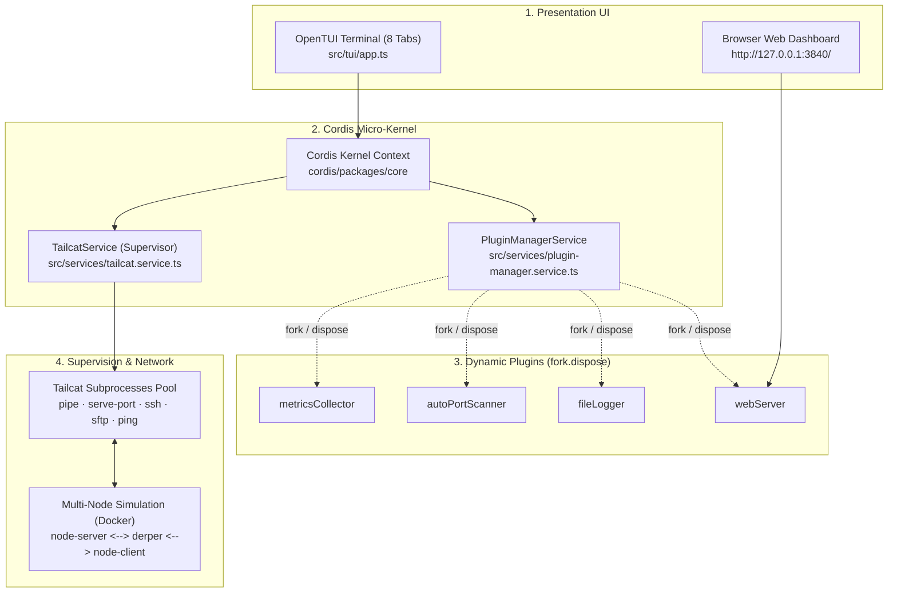
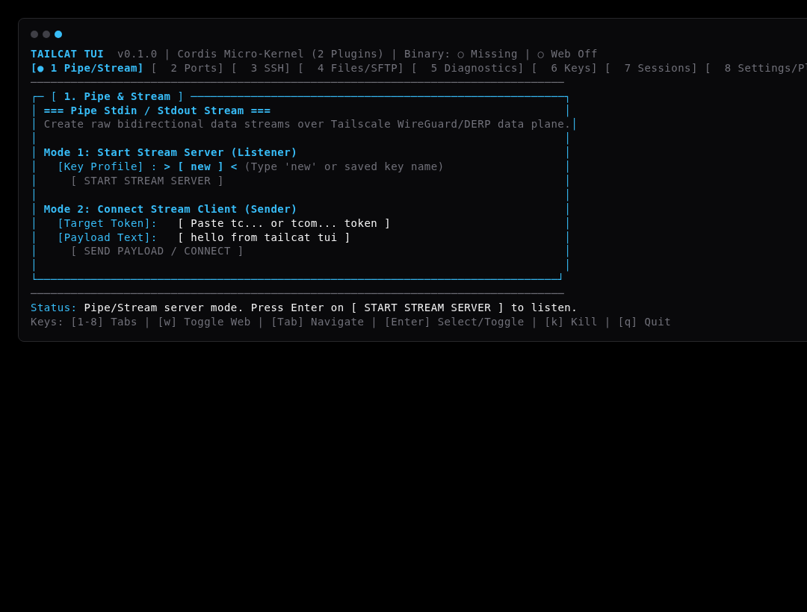
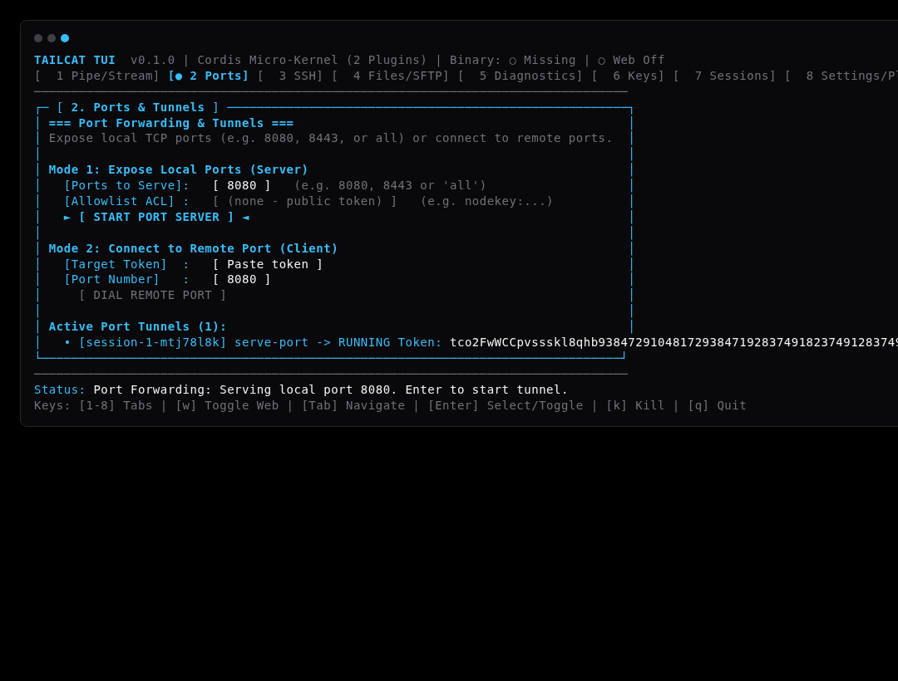
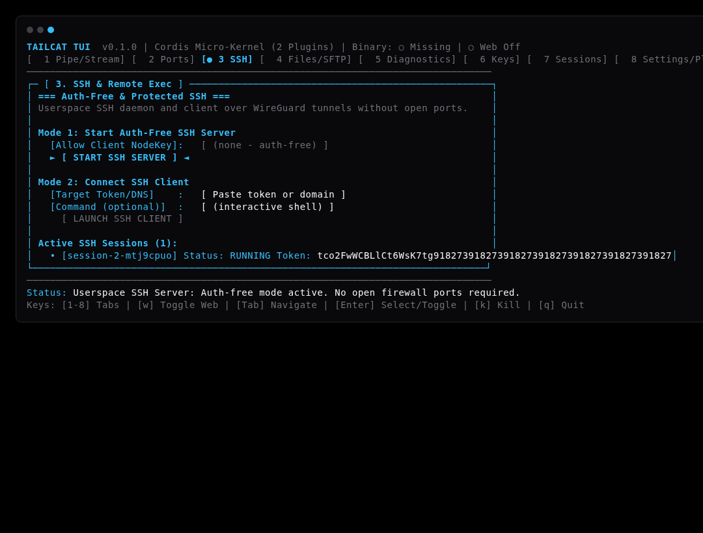
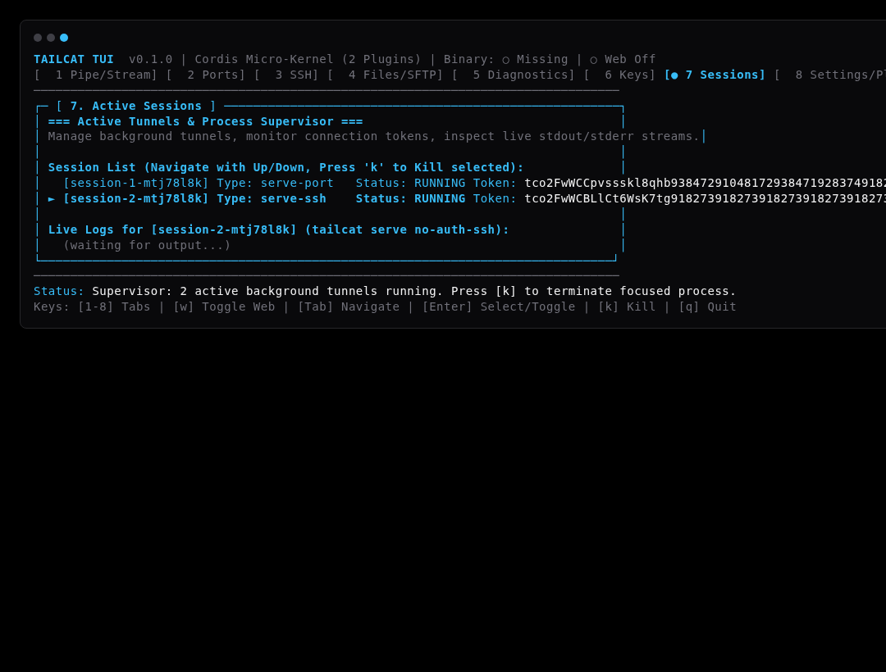
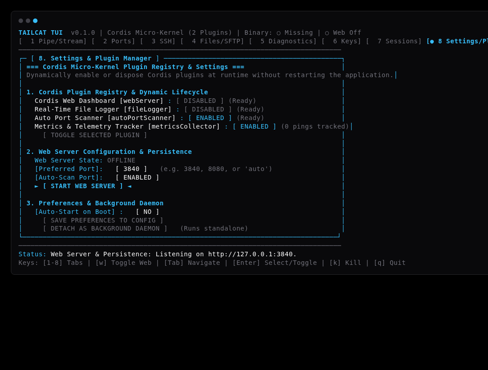
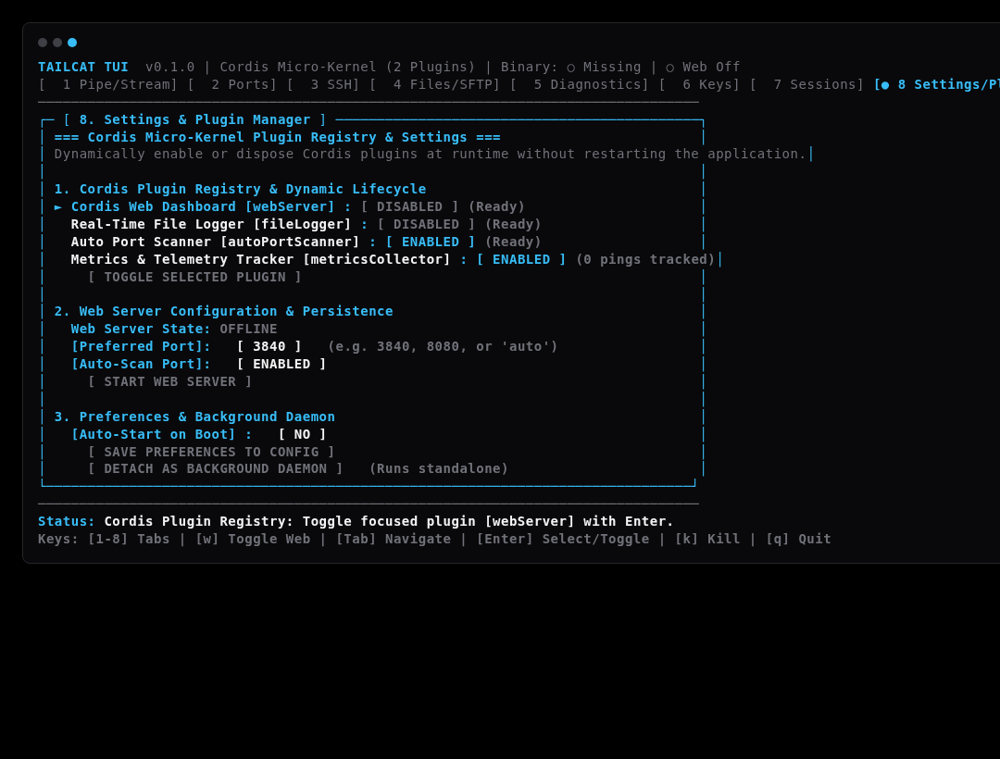
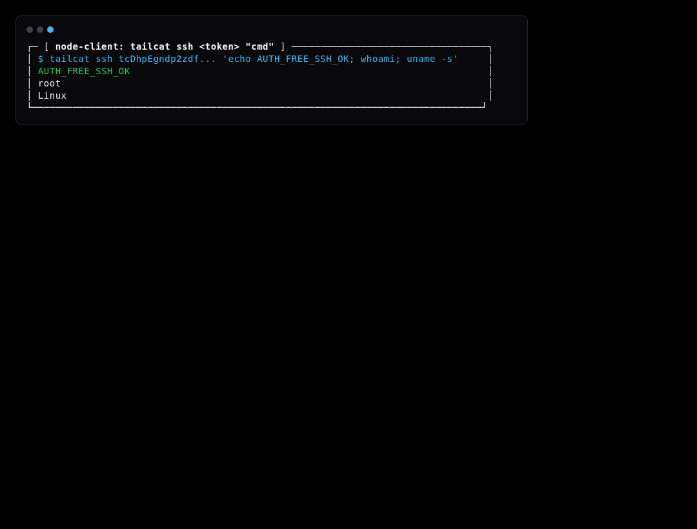
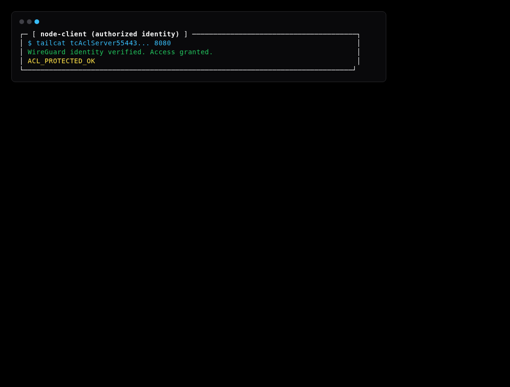
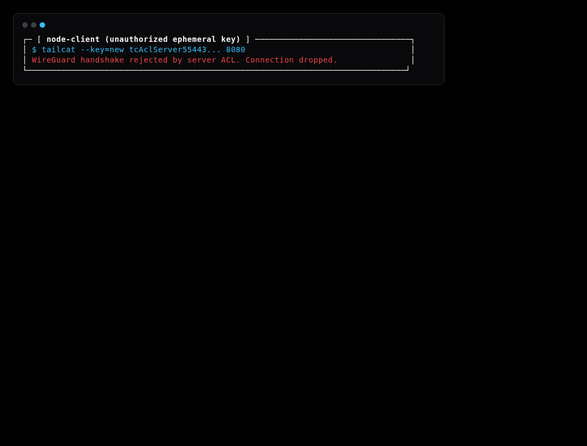

# Tailcat TUI, Web & Multi-Node Simulation

> **"Tailscale without Tailscale, interactive in your terminal, browser, and multi-node simulations."**

An interactive Terminal User Interface (TUI) powered by [OpenTUI](https://opentui.com), an embedded browser dashboard powered by [Cordis](https://github.com/cordiverse/cordis) micro-kernel architecture, and an automated multi-node Docker Compose network simulation suite for all interaction modes in [tailcat](https://github.com/tailscale/tailcat).

---

## 🌟 Key Features

- **8-Tab Multi-View Dashboard**:
  1. **Pipe & Raw Stream**: Stdin/stdout streaming and raw data pipe between peers.
  2. **Ports & Tunnels**: Expose local TCP ports (`serve 8080`, `serve all`) or dial remote ports.
  3. **SSH Server & Client**: Auth-free or ACL-protected SSH without open firewall ports.
  4. **Files & SFTP**: Drop box receiver (`recv <dir>`), SFTP file server, copy (`cp`), and remote `ls`.
  5. **Network Diagnostics**: Ping DERP vs direct UDP, SOCKS5 proxy command runner, exit node, token parser & resolver.
  6. **Key Management**: Ephemeral vs saved keys (`genkey`), client identity keys, `--allow` ACL rules, custom DERP relays.
  7. **Active Sessions**: Live process supervisor, real-time stdout/stderr log inspector, kill/restart controls (`k`).
  8. **Settings & Plugin Manager**: Cordis micro-kernel dynamic plugin registry (`webServer`, `fileLogger`, `autoPortScanner`, `metricsCollector`), runtime enable/dispose lifecycles (`fork.dispose()`), port scanner (`3840+`), config persistence, and background daemon supervisor.

- **Dual UI Support**:
  - **OpenTUI Terminal Interface**: Fast, responsive ANSI terminal UI with global hotkeys.
  - **Cordis Web Dashboard**: Browser-based dashboard serving identical management endpoints.

- **Cordis Plugin Micro-Kernel**:
  - Modular plugins can be dynamically enabled or disposed at runtime without restarting.
  - State persisted to `~/.config/tailcat-tui/config.json`.

- **Multi-Node Network Simulation Suite**:
  - Containerized Docker Compose topology (`node-server`, `node-client`, `derper` relay).
  - Simulates 100% of scenarios from `tailcat/README.md` with zero host dependencies.
  - Automated step-by-step visual screenshot recording (`.webp`) and markdown docs generation.

- **Smart Binary Resolver**:
  - Automatically locates `tailcat` in system `$PATH`, local `bin/tailcat`, or compiles directly from `tailcat/` submodule.

---

## ⚡ 2-Minute Novice Quickstart

> Full guide with visual diagrams & cheatsheets: **[docs/quickstart.md](docs/quickstart.md)**.

Every Tailcat interaction follows **Share ➔ Token ➔ Join**:

```bash
# 1. Start the interactive TUI
npm start

# 2. Key Actions (Press 1-8 to switch views):
# - Share a local port (e.g., 8080):  Tab [2] -> Type 8080 -> Press Enter -> Copy token
# - Connect to a friend's port:       Tab [2] -> Paste token in Dial -> Press Enter
# - Send a file:                      Tab [4] -> Paste receiver token & path -> Press Enter
# - Quick Web Dashboard toggle:       Press [w] to open http://127.0.0.1:3840
# - Exit TUI:                         Press [q]
```

---

## 🏗️ Architecture & Interactive Visualizers

> **Interactive Archify Visualizers**:
> * **Unified System Architecture**: [`docs/features/core/diagrams/tui-web-arch.html`](docs/features/core/diagrams/tui-web-arch.html) · [🌐 Live HTMLPreview](https://htmlpreview.github.io/?https://github.com/abdshomad/tailcat-tui-with-opentui/blob/main/docs/features/core/diagrams/tui-web-arch.html)
> * **Simulation Protocol Explorer**: [`docs/features/core/diagrams/simulation-arch.html`](docs/features/core/diagrams/simulation-arch.html) · [🌐 Live HTMLPreview](https://htmlpreview.github.io/?https://github.com/abdshomad/tailcat-tui-with-opentui/blob/main/docs/features/core/diagrams/simulation-arch.html)
> * **Cordis Web Architecture**: [`docs/features/core/diagrams/web-arch.html`](docs/features/core/diagrams/web-arch.html) · [🌐 Live HTMLPreview](https://htmlpreview.github.io/?https://github.com/abdshomad/tailcat-tui-with-opentui/blob/main/docs/features/core/diagrams/web-arch.html)



---

## 📸 Visual Showcase

For complete module-by-module walkthroughs, explore our dedicated guides:
* 📖 **[Side-by-Side Visual Comparison](docs/visual-guide.md)** — OpenTUI vs Cordis Web Dashboard.
* 🐳 **[Multi-Node Simulation Visual Guide](docs/simulation/README.md)** — Step-by-step terminal walkthroughs for all 13 simulated scenarios.
* 🌐 **[Web Dashboard Guide](docs/web/README.md)** — Comprehensive walkthrough for all Web Dashboard modules.
* 🧪 **[Comprehensive Test Cases & Quality Guide](docs/testing.md)** — Granular test catalog and verification criteria.

### 1. Dual UI: OpenTUI Terminal vs Cordis Web Dashboard

#### Pipe & Stream
| OpenTUI Terminal Interface | Cordis Web Dashboard |
| :---: | :---: |
|  |  |

#### Ports & Tunnels
| OpenTUI Terminal Interface | Cordis Web Dashboard |
| :---: | :---: |
|  |  |

#### Auth-Free SSH Server
| OpenTUI Terminal Interface | Cordis Web Dashboard |
| :---: | :---: |
|  |  |

#### Active Sessions & Process Supervisor
| OpenTUI Terminal Interface | Cordis Web Dashboard |
| :---: | :---: |
|  |  |

#### Settings & Cordis Plugin Registry
| OpenTUI Settings & Persistence Controls | OpenTUI Plugin Registry View |
| :---: | :---: |
|  |  |

---

### 2. Multi-Node Docker Network Simulation

Live terminal output captured directly from isolated multi-node test containers:

| Scenario 1: Raw Stream Delivery | Scenario 3: Remote SSH Command Execution |
| :---: | :---: |
|  |  |

| Scenario 7: WireGuard Key ACL (Authorized) | Scenario 7: WireGuard Key ACL (Blocked) |
| :---: | :---: |
|  |  |

---

## 🚀 Quick Start

### Installation

```bash
# Clone repository with submodules
git clone --recurse-submodules https://github.com/abdshomad/tailcat-tui-with-opentui.git
cd tailcat-tui-with-opentui

# Install dependencies
npm install

# Build TypeScript
npm run build
```

### Running the Terminal UI

```bash
# Launch interactive TUI
npm run dev

# Or run the built binary
node dist/index.js
```

### Running with Web Server

```bash
# Launch TUI with Web Server automatically started
node dist/index.js --web

# Launch Web Server on specific port
node dist/index.js --web --web-port=8080

# Launch as a persistent background daemon (runs even after closing terminal)
node dist/index.js --daemon --web-port=3840

# Stop active background daemon
node dist/index.js --stop-daemon
```

---

## 🐳 Multi-Node Simulation Suite (13 Scenarios)

Simulate 13 comprehensive networking scenarios across isolated Docker containers (`node-server`, `node-client`, `derper` relay):

| # | Scenario Name | Documentation | Description | Execution Command |
| :---: | :--- | :---: | :--- | :--- |
| **01** | Pipe & Raw Stream | [01-pipe-stream.md](docs/simulation/01-pipe-stream.md) | Bidirectional raw stream pipe between nodes | `./scripts/simulate.sh --scenario 01` |
| **02** | Port Forwarding (8080) | [02-port-forward.md](docs/simulation/02-port-forward.md) | Forward local TCP port to remote dialer | `./scripts/simulate.sh --scenario 02` |
| **03** | Auth-Free SSH | [03-auth-free-ssh.md](docs/simulation/03-auth-free-ssh.md) | Remote shell command execution | `./scripts/simulate.sh --scenario 03` |
| **04** | Files, Drop Box & SFTP | [04-file-sftp.md](docs/simulation/04-file-sftp.md) | Drop box upload, SFTP serve, `ls`, `cp` | `./scripts/simulate.sh --scenario 04` |
| **05** | Network Diagnostics & Ping | [05-ping-diagnostics.md](docs/simulation/05-ping-diagnostics.md) | Probe DERP relay vs direct UDP path | `./scripts/simulate.sh --scenario 05` |
| **06** | SOCKS5 Proxy Runner | [06-socks5-proxy.md](docs/simulation/06-socks5-proxy.md) | Tunnel arbitrary CLI commands via SOCKS5 | `./scripts/simulate.sh --scenario 06` |
| **07** | Key Management & ACL | [07-key-management-acl.md](docs/simulation/07-key-management-acl.md) | WireGuard public key ACL enforcement | `./scripts/simulate.sh --scenario 07` |
| **08** | Token Parse & Resolve | [08-token-parse-resolve.md](docs/simulation/08-token-parse-resolve.md) | Parse token JSON & resolve DERP nodes | `./scripts/simulate.sh --scenario 08` |
| **09** | Multi-Hop Chained Tunnels | [09-multi-hop-tunnel.md](docs/simulation/09-multi-hop-tunnel.md) | Route across Node A $\rightarrow$ Node B $\rightarrow$ Node C | `./scripts/simulate.sh --scenario 09` |
| **10** | Daemon Lifecycle & Recovery | [10-daemon-lifecycle-auto-reconnect.md](docs/simulation/10-daemon-lifecycle-auto-reconnect.md) | Crash detection, stale PID cleanup & restore | `./scripts/simulate.sh --scenario 10` |
| **11** | ACL Security & Denial | [11-acl-denial-security.md](docs/simulation/11-acl-denial-security.md) | Block unauthorized keys & malformed tokens | `./scripts/simulate.sh --scenario 11` |
| **12** | High-Concurrency Streams | [12-high-concurrency-stream.md](docs/simulation/12-high-concurrency-stream.md) | Concurrent parallel streams & data integrity | `./scripts/simulate.sh --scenario 12` |
| **13** | Headless Web REST API | [13-web-server-headless-api.md](docs/simulation/13-web-server-headless-api.md) | Headless HTTP control and metrics telemetry | `./scripts/simulate.sh --scenario 13` |

```bash
# Run all 13 simulation scenarios in Docker Compose
npm run test:simulation

# Or run directly via CLI runner
./scripts/simulate.sh --all

# Run a specific scenario (e.g., Scenario 09: Multi-Hop Tunnels)
./scripts/simulate.sh --scenario 09

# Run with public Tailcat relays instead of local DERP
./scripts/simulate.sh --all --derp public
```

---

## 🔌 Headless REST API & Telemetry Reference

When the Web Server is active (either embedded or running as a background daemon), it exposes headless REST JSON endpoints:

### 1. `GET /api/status`
Returns service status, active port, daemon status, PID, and enabled plugins:
```bash
curl -s http://127.0.0.1:3840/api/status
```
```json
{
  "status": "online",
  "port": 3840,
  "running": true,
  "daemon": false,
  "daemonPid": null,
  "binary": { "available": true, "path": "/usr/local/bin/tailcat", "source": "system" },
  "plugins": ["webServer", "autoPortScanner", "metricsCollector", "fileLogger"]
}
```

### 2. `GET /api/metrics`
Returns live peer telemetry, tracked ping counts, and average latency:
```bash
curl -s http://127.0.0.1:3840/api/metrics
```
```json
{
  "trackedPeers": 3,
  "totalPings": 12,
  "avgLatencyMs": 1.45
}
```

### 3. `GET /api/sessions`
Returns active supervised subprocess sessions, tokens, and statuses:
```bash
curl -s http://127.0.0.1:3840/api/sessions
```
```json
[
  {
    "id": "session-1-m3a9",
    "type": "serve-8080",
    "command": "tailcat serve 8080",
    "status": "running",
    "token": "tco2FwWCBhlxbJAG4BM-..."
  }
]
```

### 4. `POST /api/action`
Executes service actions (ping, scan, port tunnel) headlessly:
```bash
curl -s -X POST http://127.0.0.1:3840/api/action \
  -H "Content-Type: application/json" \
  -d '{"action": "ping", "target": "tco2FwWCBhlxbJAG4BM-..."}'
```
```json
{
  "success": true,
  "action": "ping",
  "received": {
    "action": "ping",
    "target": "tco2FwWCBhlxbJAG4BM-..."
  }
}
```

---

## ⌨️ Keyboard Shortcuts

| Shortcut | Action |
|:---|:---|
| `[1] - [8]` | Switch directly to Tab 1 through 8 |
| `[w]` | Instant toggle Web Server (start / stop) from any tab |
| `[Tab] / [Shift+Tab]` | Cycle between input fields and action buttons |
| `[Enter]` | Execute focused action or toggle selected plugin |
| `[k]` | Kill selected process in Tab 7 (Active Sessions) |
| `[q] / [Ctrl+C]` | Cleanly exit TUI |

---

## 🏗️ Architecture

```
tailcat-tui-with-opentui/
├── src/
│   ├── services/
│   │   ├── tailcat.service.ts          # Cordis Service: Process supervisor & stream manager
│   │   ├── plugin-manager.service.ts   # Cordis Service: Plugin discovery, forking & disposal
│   │   ├── web-server.plugin.ts        # Cordis Plugin: HTTP Web dashboard & REST endpoints
│   │   ├── file-logger.plugin.ts       # Cordis Plugin: Session disk file logger
│   │   ├── auto-port-scanner.plugin.ts # Cordis Plugin: TCP port prober & allocator
│   │   ├── metrics-collector.plugin.ts # Cordis Plugin: Peer ping latency & telemetry
│   │   └── session.types.ts            # Typed session contracts and Cordis events
│   ├── tui/
│   │   ├── app.ts                      # Main OpenTUI application shell & event loop
│   │   ├── ansi.ts                     # ANSI styling, colors, and box framing
│   │   ├── state.ts                    # Application and form state store
│   │   └── views/                      # Modular view renderers for tabs 1-8
│   └── utils/
│       ├── binary-resolver.ts          # Smart PATH / bin / submodule resolver
│       ├── port-scanner.ts             # Sequential socket availability scanner
│       ├── daemon-manager.ts           # Config storage and detached daemon supervisor
│       ├── terminal-screenshot.ts      # Headless ANSI-to-WebP renderer
│       └── web-screenshot.ts           # Async headless Chrome WebP capture
├── docker/
│   ├── docker-compose.yml              # Topology with derper, node-server, node-client
│   ├── Dockerfile.node                 # Multi-stage image building tailcat + test tools
│   └── derper/
│       └── Dockerfile.derper           # Local test DERP relay & STUN server
├── scripts/
│   ├── simulate.sh                     # CLI simulation runner with exit codes & reporting
│   └── scenarios/                      # Modular shell test scripts (Scenarios 01-13)
├── tests/
│   ├── service.test.mjs                # Unit tests for Cordis TailcatService
│   ├── plugins.test.mjs                # Unit tests for Cordis Plugin Registry, lifecycles & REST APIs
│   ├── views.test.mjs                  # Unit tests for TUI views & action handlers
│   ├── web-serving.test.mjs            # Unit tests for port scanner, daemon & web plugin
│   ├── simulation.test.mjs             # Node.js runner integration for Docker simulations
│   └── e2e/                            # Visual screenshot automated test suite
├── screenshots/
│   ├── tui/                            # OpenTUI terminal screenshots
│   ├── web/                            # Cordis web dashboard screenshots
│   └── simulation/                     # Multi-node simulation terminal frame screenshots
└── docs/
    ├── visual-guide.md                 # TUI vs Web comparison guide
    ├── testing.md                      # Comprehensive test cases & quality guide
    ├── simulation/                     # Step-by-step visual guides for all 13 scenarios
    └── web/                            # Documentation for all 7 Web dashboard modules
```

---

## 🧪 Testing & Verification Architecture

> For the exhaustive per-assertion test catalog, preconditions, and pass criteria, see **[docs/testing.md](docs/testing.md)**.

Tailcat features a 3-tier automated testing and visual verification suite:

### 1. In-Process Unit & Cordis Service Tests
Validates the micro-kernel service lifecycle, dynamic plugin registration/disposal (`tests/plugins.test.mjs`), port scanning heuristics, configuration storage, view rendering, REST API endpoints (`/api/status`, `/api/metrics`, `/api/sessions`, `/api/action`), and process supervision:
```bash
npm test
```

### 2. Multi-Node Docker Network Simulations (13 Scenarios)
Runs live, end-to-end integration tests for all 13 networking scenarios across isolated Docker containers (`node-server`, `node-client`, `derper` relay):
```bash
# Run all 13 simulation scenarios
npm run test:simulation

# Run via CLI orchestrator with custom options
./scripts/simulate.sh --all
./scripts/simulate.sh --scenario 09-multi-hop-tunnel
./scripts/simulate.sh --all --derp public
```

### 3. Automated E2E Visual Screenshot & Docs Generator
Renders deterministic, high-resolution `.webp` screenshots across OpenTUI, Cordis Web, and Simulation terminal frames, auto-generating markdown visual guides:
```bash
npm run test:screenshots
```

| Asset Directory | Source Engine | Format |
| :--- | :--- | :--- |
| `screenshots/tui/` | `TerminalScreenshot` (ANSI to dark-mode window frame) | `.webp` |
| `screenshots/web/` | `WebScreenshot` (Headless Chrome 1280x800 + ffmpeg) | `.webp` |
| `screenshots/simulation/` | `TerminalScreenshot` (Multi-node terminal outputs) | `.webp` |

---

## 📜 License

MIT License
