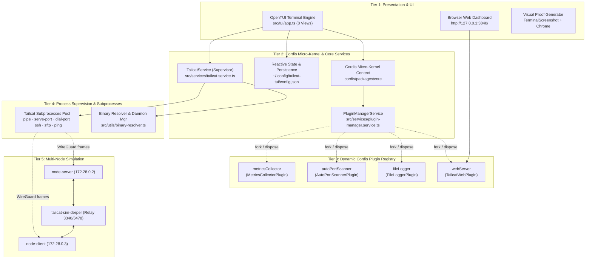

# Feature: Tailcat TUI with OpenTUI, Web & Multi-Node Simulation

## 🏗️ Architecture Diagram (Archify)

> **Interactive Archify Artifact**: [`docs/features/core/diagrams/tui-web-arch.html`](../core/diagrams/tui-web-arch.html) · [🌐 Live HTMLPreview](https://htmlpreview.github.io/?https://github.com/abdshomad/tailcat-tui-with-opentui/blob/main/docs/features/core/diagrams/tui-web-arch.html)

- [Cordis](https://github.com/cordiverse/cordis) micro-kernel hosting `TailcatService`, `PluginManagerService`, and dynamic extension plugins.
- OpenTUI 8-tab dashboard covering all `tailcat/README.md` interactions:
  - Tab 1: Pipe / Stream (Server listener, client payload sender).
  - Tab 2: Ports (Serve local ports, dial remote ports).
  - Tab 3: SSH (Auth-free SSH daemon, client shell execution).
  - Tab 4: Files (Drop box inbox, SFTP file server, copy, remote ls).
  - Tab 5: Diagnostics (Ping direct vs DERP, SOCKS5 proxy, exit node, parse/resolve token).
  - Tab 6: Keys (WireGuard keypair generator, list/delete keys, fixed-region).
  - Tab 7: Active Sessions (Live log inspector, process supervisor, termination).
  - Tab 8: Settings & Plugin Manager (Dynamic Cordis plugin registry, runtime enable/dispose lifecycles, port scanner, config persistence, detached daemon mode).
- Cordis Plugin Micro-Kernel Architecture:
  - `webServer` (`TailcatWebPlugin`): Embedded HTTP Web Dashboard, UI controls & REST APIs on port `3840+`.
  - `fileLogger` (`FileLoggerPlugin`): Streams session stdout/stderr logs into `~/.config/tailcat-tui/logs/session-{id}.log`.
  - `autoPortScanner` (`AutoPortScannerPlugin`): Probes TCP socket availability and allocates free ports sequentially.
  - `metricsCollector` (`MetricsCollectorPlugin`): Tracks peer latency, ping count, and DERP relay paths vs direct UDP upgrades.
  - Dynamic Lifecycle: Calling `disablePlugin()` executes `fork.dispose()`, unbinding event listeners and freeing resources instantly without restarting.
  - State Persistence: Stored in `~/.config/tailcat-tui/config.json`.
- Global Hotkeys:
  - `[1-8]`: Direct tab selection.
  - `[w]`: Instant Web Server toggle (start/stop) from any tab.
  - `[Tab] / [Shift+Tab]`: Cycle active form inputs and action buttons.
  - `[Enter]`: Execute focused action or toggle selected plugin.
  - `[k]`: Kill selected process in Sessions view.
  - `[q] / [Ctrl+C]`: Clean exit.
- Smart Binary & Port Management:
  - Auto-resolves `tailcat` binary from `$PATH`, local `bin/`, or submodule build.
  - Sequential free port scanner allocating available ports starting from `3840`.
  - Config file storage in `~/.config/tailcat-tui/config.json`.
  - Detached background daemon supervisor tracking PID in `~/.config/tailcat-tui/web-server.pid`.
- Multi-Node Network Simulation Suite:
  - Docker Compose topology (`node-server`, `node-client`, `derper` relay).
  - Complete 8-scenario coverage of all `tailcat/README.md` interactions.
  - CLI runner (`./scripts/simulate.sh`) with `--all`, `--scenario`, and `--derp` flags.
  - Integrated with `npm run test:simulation`.
- Automated E2E Visual Screenshot & Documentation Generator:
  - Hierarchy: `screenshots/{tui,web,simulation}/{module}/{feature}/{step-number}-{slug}.webp`.
  - Markdown generators auto-populating `docs/simulation/*.md` and `docs/web/*.md`.
  - Executable via `npm run test:screenshots`.
