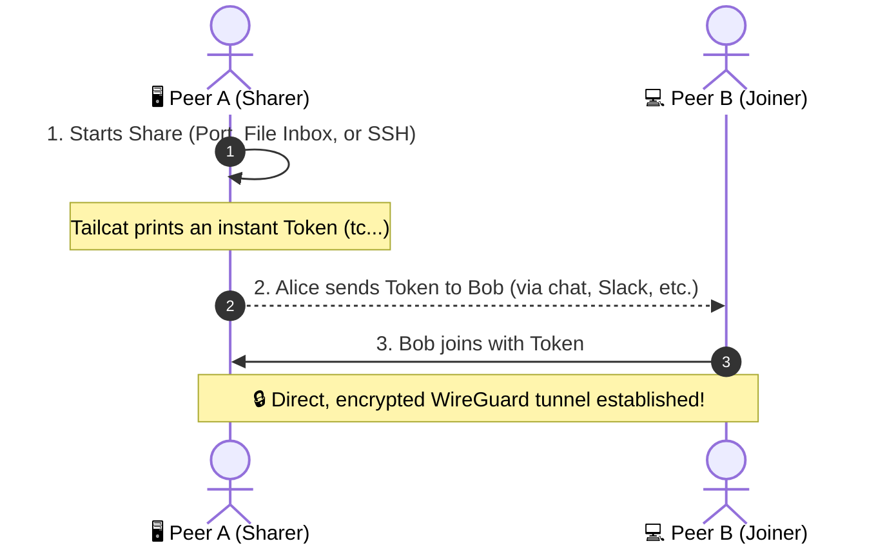

# ⚡ Tailcat 2-Minute Novice Quickstart Guide

Welcome to **Tailcat**! Think of Tailcat as **"instant peer-to-peer magic"**: it lets two computers connect directly to share web servers, transfer files, or run remote terminal sessions without opening router ports, setting up static IPs, or configuring firewalls.

---

## 🧠 The Core Mental Model: Share ➔ Token ➔ Join

Every Tailcat interaction follows the same simple 3-step pattern:



---

## 🚀 4 Zero-Config Beginner Recipes

### 1. 🌐 Share a Local Web Server / Port
*Want a friend or coworker to test your local web app running on `localhost:3000` or `localhost:8080`?*

| Method | Step 1: Sharer (Peer A) | Step 2: Joiner (Peer B) |
| :--- | :--- | :--- |
| **Interactive TUI** | Press `[2]` (Ports) ➔ Type `8080` ➔ Press `[Enter]` to copy token. | Press `[2]` ➔ Paste token in *Dial Remote Port* ➔ Press `[Enter]`. |
| **Raw CLI** | `tailcat serve 8080`<br/>*(Outputs `tc...` token)* | `tailcat <token>`<br/>*(Accesses the remote port locally)* |

---

### 2. 📁 Send & Receive Files
*Transfer large files directly between two machines with zero cloud storage limits.*

| Method | Step 1: Receiver (Peer A) | Step 2: Sender (Peer B) |
| :--- | :--- | :--- |
| **Interactive TUI** | Press `[4]` (Files) ➔ Select *Drop Box Inbox* ➔ Press `[Enter]`. | Press `[4]` ➔ Paste token & file path ➔ Press `[Enter]`. |
| **Raw CLI** | `tailcat recv ./inbox`<br/>*(Listens for incoming files)* | `tailcat cp <token> project-data.zip`<br/>*(Uploads file directly into Peer A's `./inbox`)* |

---

### 3. 💻 Instant Remote Terminal / SSH
*Get instant shell access to your remote server or workstation without passwords or port 22 open.*

| Method | Step 1: Server (Peer A) | Step 2: Client (Peer B) |
| :--- | :--- | :--- |
| **Interactive TUI** | Press `[3]` (SSH) ➔ Select *Serve Auth-Free SSH* ➔ Press `[Enter]`. | Press `[3]` ➔ Paste token in *Client SSH* ➔ Press `[Enter]`. |
| **Raw CLI** | `tailcat serve no-auth-ssh`<br/>*(Spawns secure userspace SSH)* | `tailcat <token>`<br/>*(Opens interactive bash terminal on Peer A)* |

---

### 4. 🎛️ Interactive TUI Master Controls

Launch the interactive OpenTUI application in one command:
```bash
npm start
```

| Key | Action | What It Does |
| :---: | :--- | :--- |
| `[1]` – `[8]` | **Switch Tab** | Jump directly to Pipe (`1`), Ports (`2`), SSH (`3`), Files (`4`), Diag (`5`), Keys (`6`), Sessions (`7`), or Settings (`8`). |
| `[Tab]` | **Cycle Inputs** | Move focus through input fields and action buttons. |
| `[Enter]` | **Execute Action** | Run the selected action or start listening. |
| `[w]` | **Web Toggle** | Instantly start/stop the browser dashboard (`http://127.0.0.1:3840`). |
| `[k]` | **Kill Tunnel** | Terminate the active tunnel session in Tab `[7]` (Active Sessions). |
| `[q]` | **Quit** | Cleanly shut down all background sessions and exit. |

---

## 🔍 How Does It Work Behind the Scenes?

- **Zero Port Forwarding**: Tailcat uses **Tailscale DERP relays** and **WireGuard NAT traversal** to punch through home routers, corporate NATs, and firewalls.
- **End-to-End Encryption**: Traffic is encrypted using WireGuard public-key cryptography directly between peers.
- **Self-Contained Tokens**: A token like `tco2FwW...` contains the public key and relay location needed to find the peer instantly.

---

## 📖 Next Steps

- 🖥️ **[Side-by-Side Visual Comparison](visual-guide.md)** — OpenTUI vs Cordis Web Dashboard.
- 🧪 **[Comprehensive Test Catalog](testing.md)** — Unit tests, REST API endpoints, and simulation suites.
- 🐳 **[Multi-Node Simulation Architecture](simulation/README.md)** — Step-by-step walkthroughs for 13 network scenarios.
