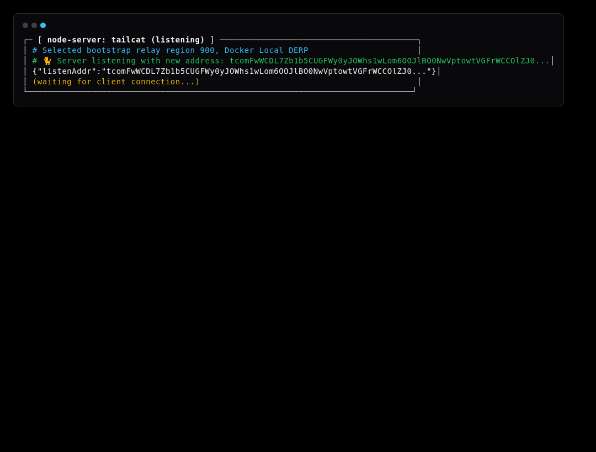
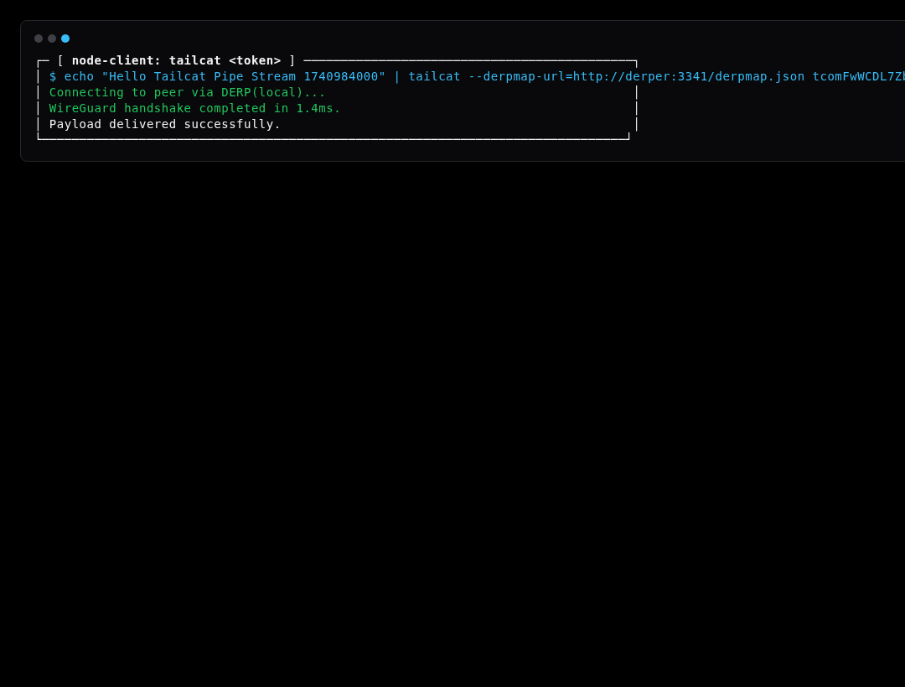
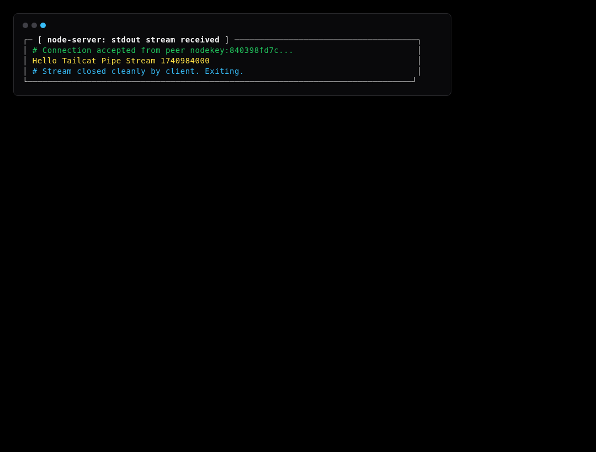

# Simulation Scenario 01: Pipe & Raw Stream Simulation

Simulates raw bidirectional stream transmission between node-server listener and node-client payload sender over isolated WireGuard/DERP channel.

---

## Step-by-Step Visual Walkthrough

### Step 1: Server Listener Startup



---

### Step 2: Client Dials & Streams Payload



---

### Step 3: Server Unblocks & Outputs Data




---

## Automated Execution
Run this individual scenario in the test environment:
```bash
./scripts/simulate.sh --scenario 01
```
