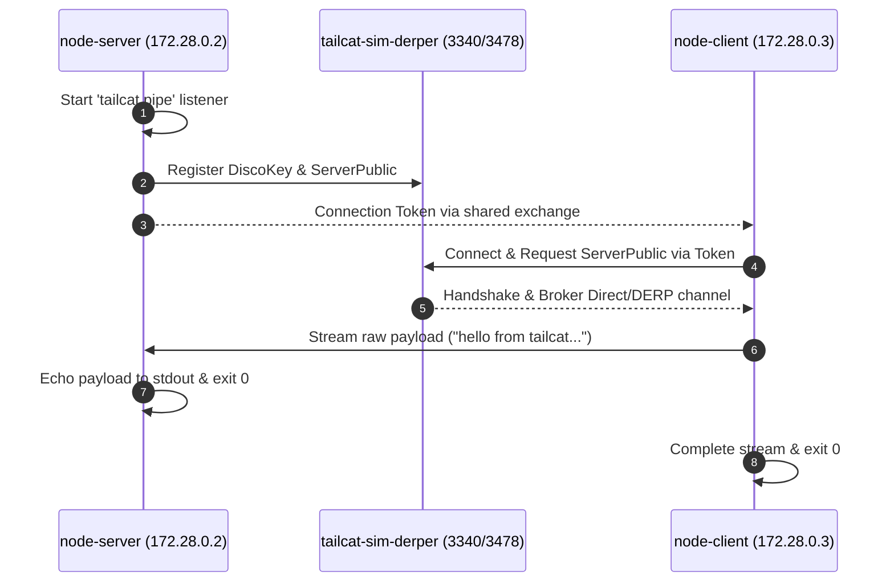

# Simulation Scenario 01: Pipe & Raw Stream Simulation

Simulates raw bidirectional stream transmission between node-server listener and node-client payload sender over isolated WireGuard/DERP channel.

> **UI Mapping**: OpenTUI **Tab 1: Pipe / Stream** (`PipeView`) | Cordis Web Dashboard **`/?tab=pipe`**  
> **Interactive Archify Visualizer**: [`docs/features/core/diagrams/simulation-arch.html`](../features/core/diagrams/simulation-arch.html) · [🌐 Live HTMLPreview](https://htmlpreview.github.io/?https://github.com/abdshomad/tailcat-tui-with-opentui/blob/main/docs/features/core/diagrams/simulation-arch.html)



---

## Step-by-Step Visual Walkthrough

### Step 1: Server Listener Startup


---

### Step 2: Client Dials & Streams Payload


---

### Step 3: Server Unblocks & Outputs Data


---

## Automated Execution
Run this individual scenario in the test environment:
```bash
./scripts/simulate.sh --scenario 01
```
