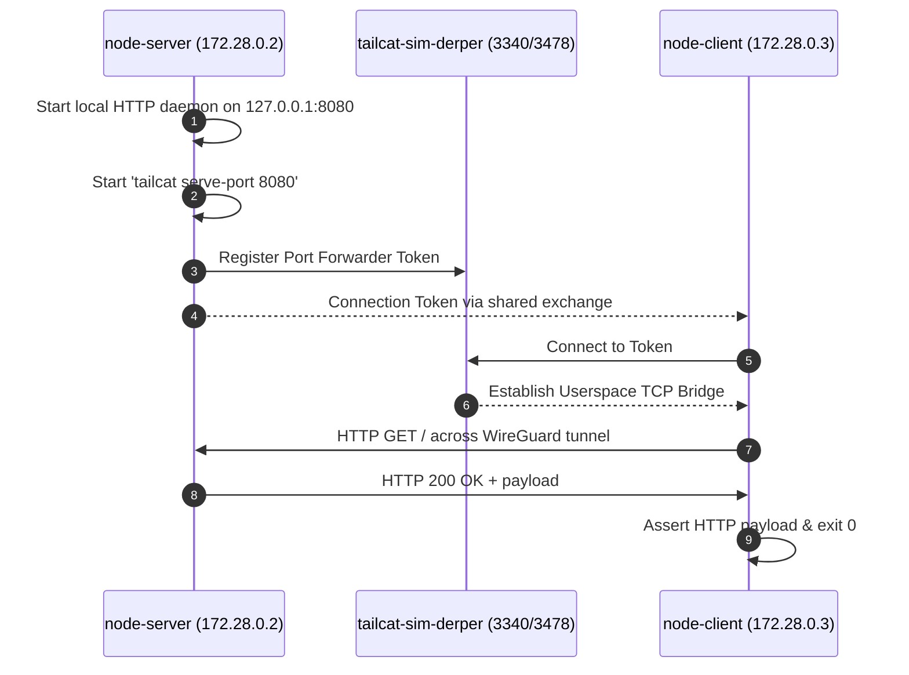
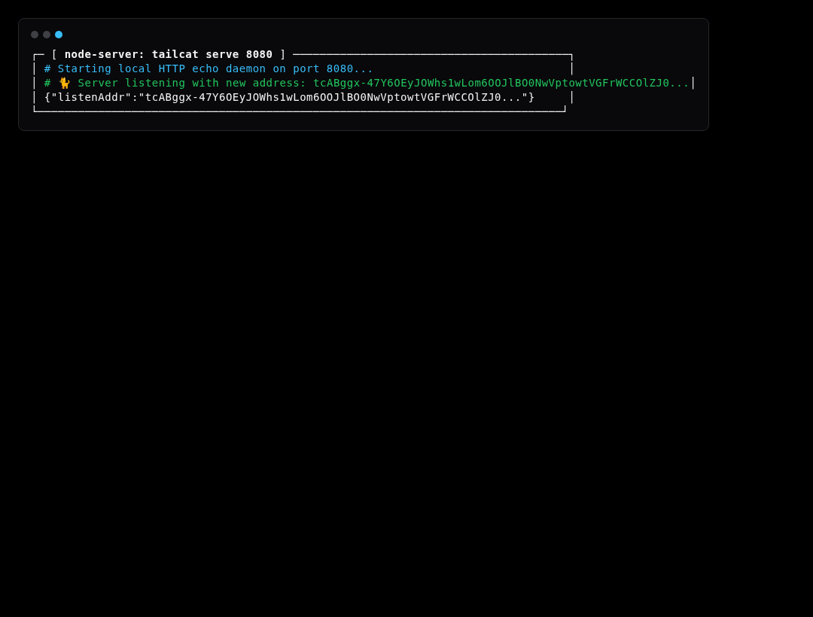
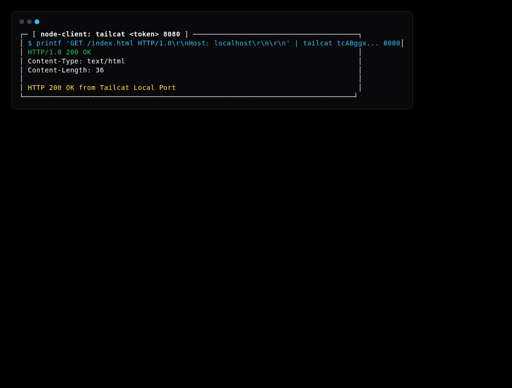

# Simulation Scenario 02: Port Forwarding (8080) Simulation

Exposes local HTTP service on port 8080 through the tunnel, dialed directly by remote client over userspace netstack.

> **UI Mapping**: OpenTUI **Tab 2: Ports / Tunnels** (`PortsView`) | Cordis Web Dashboard **`/?tab=ports`**  
> **Interactive Archify Visualizer**: [`docs/features/core/diagrams/simulation-arch.html`](../features/core/diagrams/simulation-arch.html) · [🌐 Live HTMLPreview](https://htmlpreview.github.io/?https://github.com/abdshomad/tailcat-tui-with-opentui/blob/main/docs/features/core/diagrams/simulation-arch.html)



---

## Step-by-Step Visual Walkthrough

### Step 1: Start Port Forwarder Daemon



---

### Step 2: Client Dials Remote Port




---

## Automated Execution
Run this individual scenario in the test environment:
```bash
./scripts/simulate.sh --scenario 02
```
