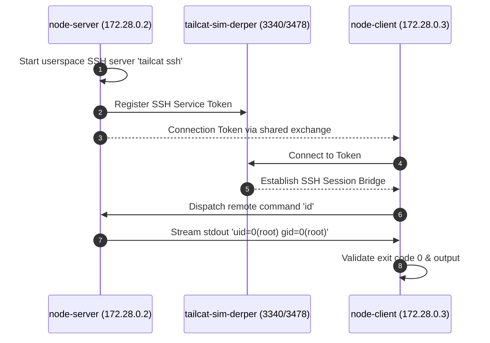

# Simulation Scenario 03: Auth-Free SSH Server & Remote Exec Simulation

Spawns userspace auth-free SSH daemon without inbound firewall ports and runs remote commands over WireGuard tunnel.

> **UI Mapping**: OpenTUI **Tab 3: SSH** (`SSHView`) | Cordis Web Dashboard **`/?tab=ssh`**  
> **Interactive Archify Visualizer**: [`docs/features/core/diagrams/simulation-arch.html`](../features/core/diagrams/simulation-arch.html) · [🌐 Live HTMLPreview](https://htmlpreview.github.io/?https://github.com/abdshomad/tailcat-tui-with-opentui/blob/main/docs/features/core/diagrams/simulation-arch.html)



---

## Step-by-Step Visual Walkthrough

### Step 1: Launch Auth-Free SSH Daemon


---

### Step 2: Client Executes Remote Command


---

## Automated Execution
Run this individual scenario in the test environment:
```bash
./scripts/simulate.sh --scenario 03
```
