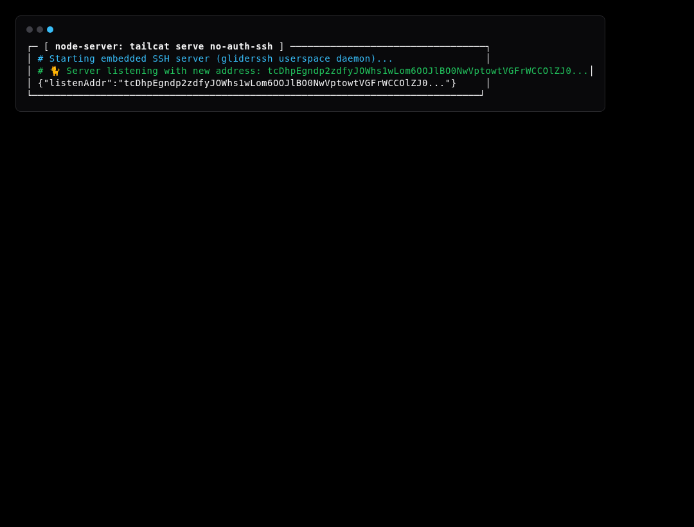

# Simulation Scenario 03: Auth-Free SSH Server & Remote Exec Simulation

Spawns userspace auth-free SSH daemon without inbound firewall ports and runs remote commands over WireGuard tunnel.

---

## Step-by-Step Visual Walkthrough

### Step 1: Launch Auth-Free SSH Daemon



---

### Step 2: Client Executes Remote Command


---

## Automated Execution
Run this individual scenario in the test environment:
```bash
./scripts/simulate.sh --scenario 03
```
