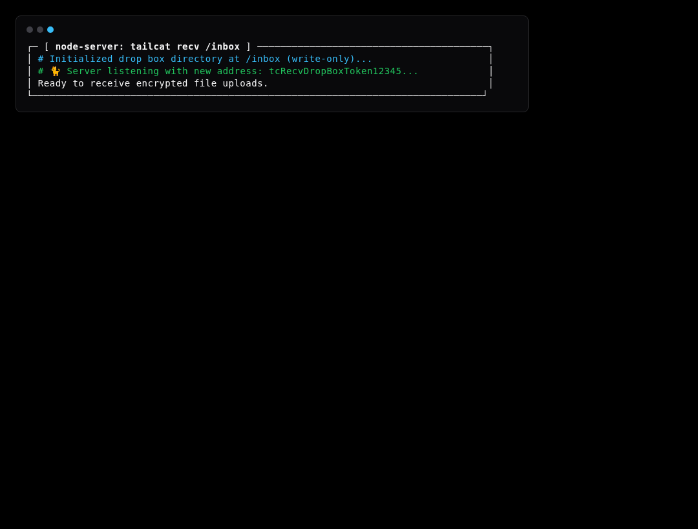
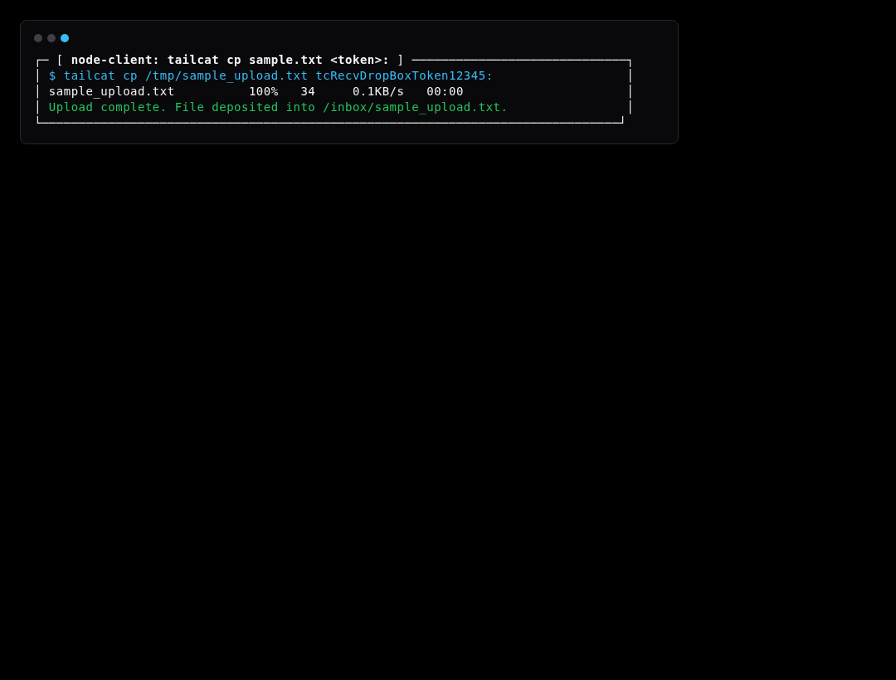
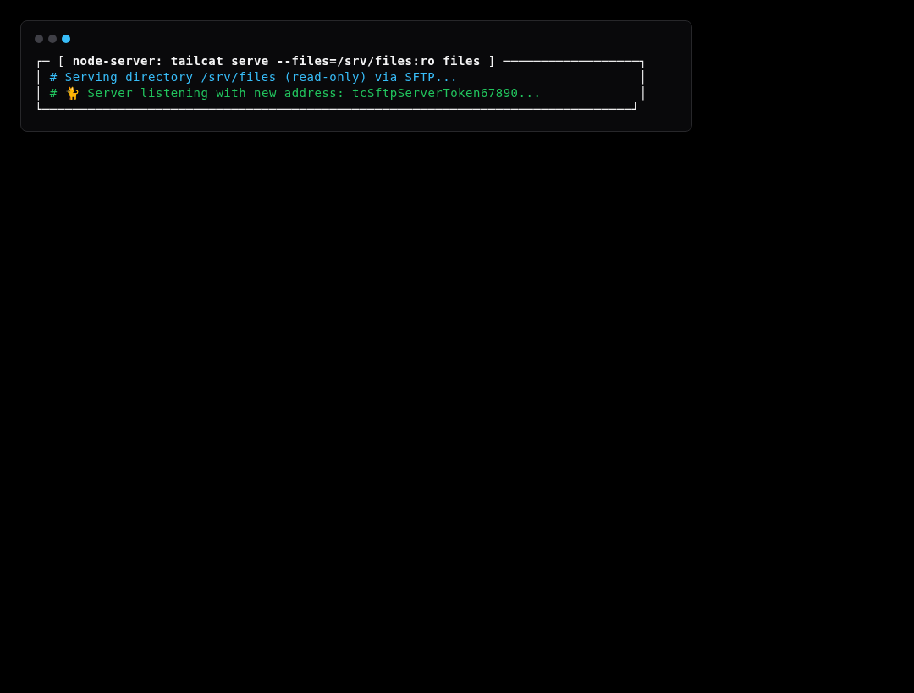
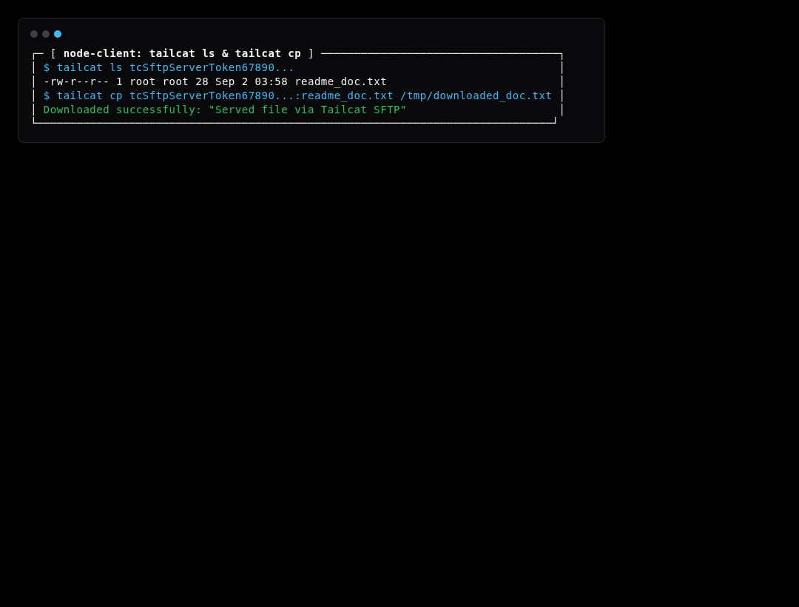

# Simulation Scenario 04: Files, Drop Box & SFTP Transfers Simulation

Simulates write-only drop box receiver (`tailcat recv /inbox`) and SFTP directory server (`tailcat serve files`) with `tailcat cp` and `tailcat ls`.

> **UI Mapping**: OpenTUI **Tab 4: Files** (`FilesView`) | Cordis Web Dashboard **`/?tab=files`**  
> **Interactive Archify Visualizer**: [`docs/features/core/diagrams/simulation-arch.html`](../features/core/diagrams/simulation-arch.html) · [🌐 Live HTMLPreview](https://htmlpreview.github.io/?https://github.com/abdshomad/tailcat-tui-with-opentui/blob/main/docs/features/core/diagrams/simulation-arch.html)

```mermaid
sequenceDiagram
    autonumber
    participant Server as node-server (172.28.0.2)
    participant Relay as tailcat-sim-derper (3340/3478)
    participant Client as node-client (172.28.0.3)

    rect rgb(20, 30, 45)
        Note over Server,Client: Part A: Write-Only Drop Box Inbox
        Server->>Server: Start 'tailcat recv /inbox'
        Server-->>Client: Drop Box Token
        Client->>Server: 'tailcat cp sample.txt <token>'
        Server->>Server: Write payload to /inbox/sample.txt
    end

    rect rgb(35, 25, 45)
        Note over Server,Client: Part B: SFTP Directory Server & Listing
        Server->>Server: Start 'tailcat serve files /srv/files'
        Server-->>Client: SFTP Token
        Client->>Server: 'tailcat ls <token>' -> Receive file list
        Client->>Server: 'tailcat cp <token>/remote.txt local.txt'
        Client->>Client: Verify downloaded payload
    end
```



---

## Step-by-Step Visual Walkthrough

### Step 1: Start Drop Box Inbox Receiver



---

### Step 2: Client Copies File into Drop Box



---

### Step 3: Serve SFTP Files Directory



---

### Step 4: Client Explores & Downloads File




---

## Automated Execution
Run this individual scenario in the test environment:
```bash
./scripts/simulate.sh --scenario 04
```
