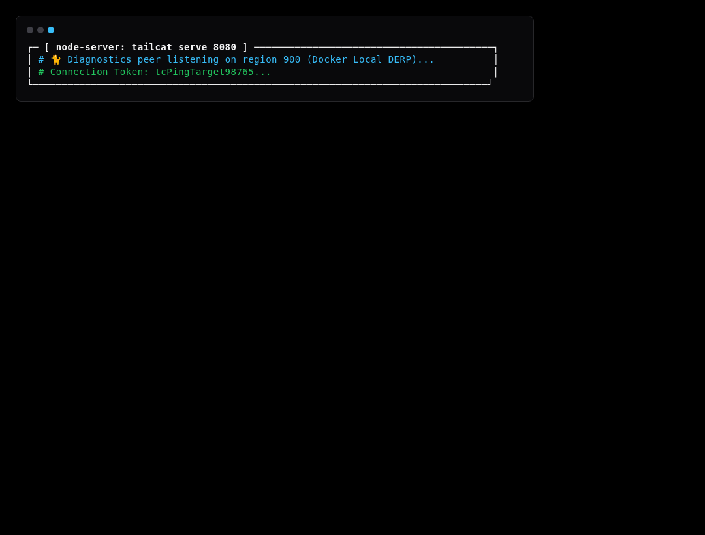
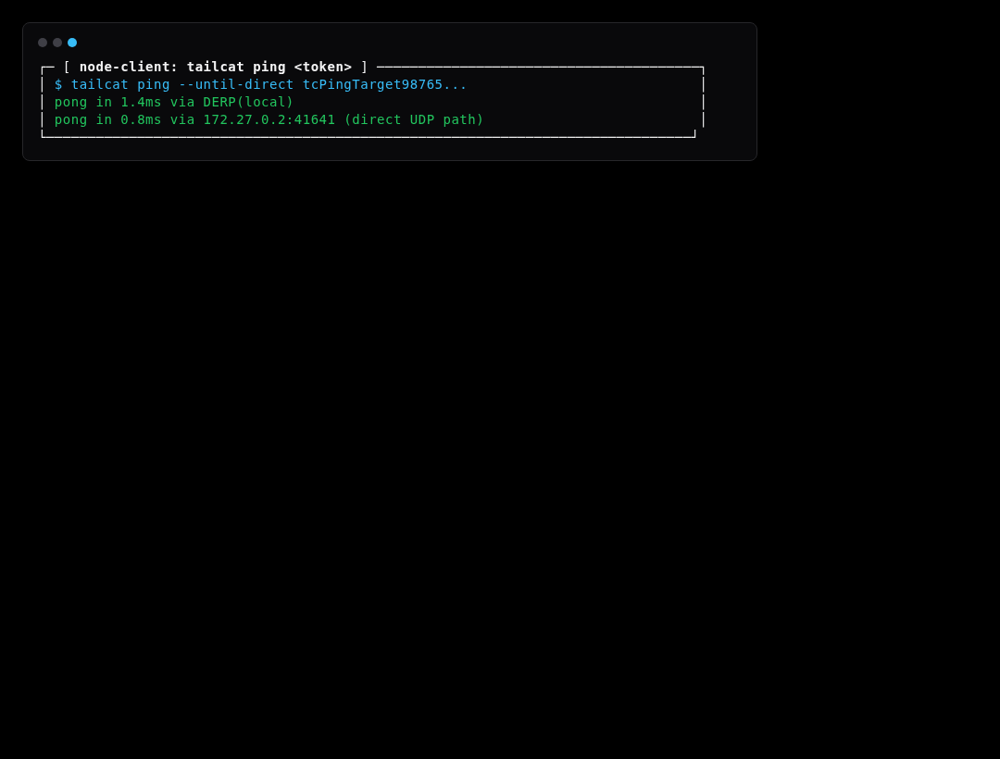

# Simulation Scenario 05: Network Diagnostics & Ping Simulation

Probes peer latency and validates DERP relay paths vs direct peer-to-peer UDP punch.

---

## Step-by-Step Visual Walkthrough

### Step 1: Start Diagnostics Target Listener



---

### Step 2: Client Measures Ping Latency




---

## Automated Execution
Run this individual scenario in the test environment:
```bash
./scripts/simulate.sh --scenario 05
```
