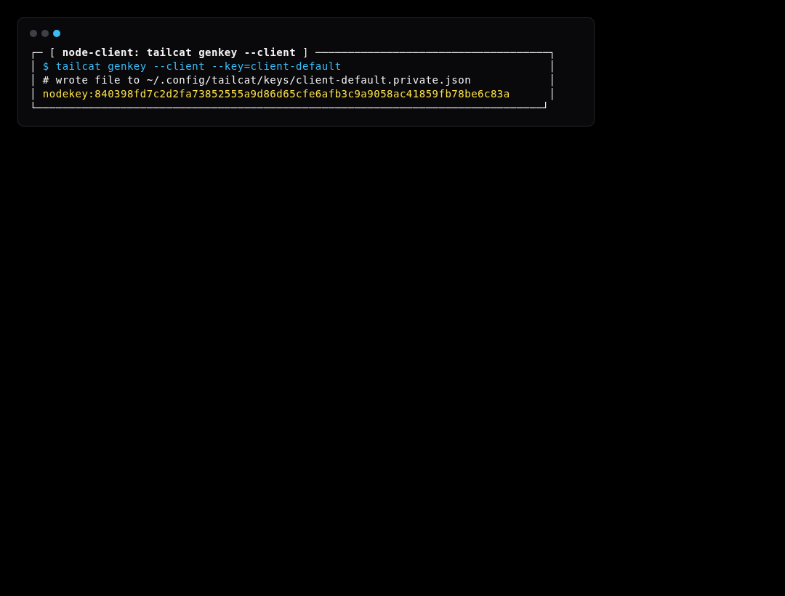
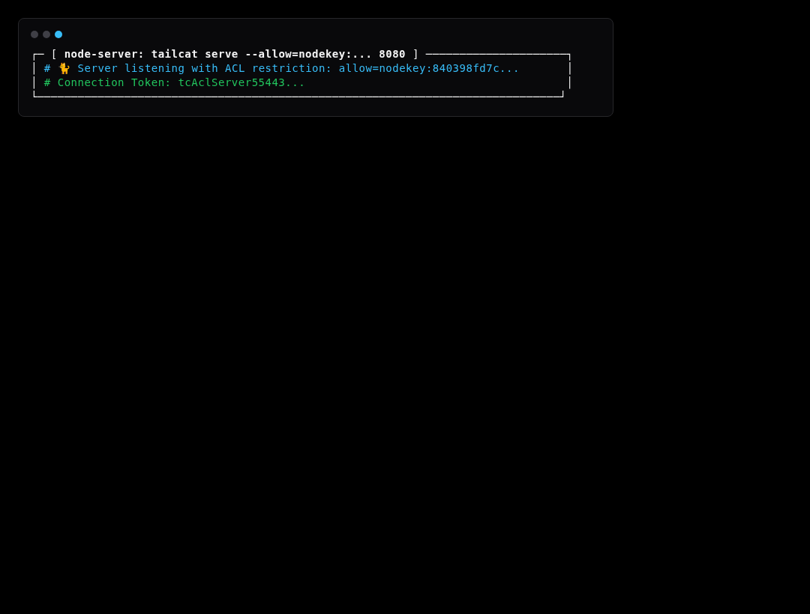

# Simulation Scenario 07: Key Management & WireGuard ACL Simulation

Restricts server access to approved client public keys (`--allow=nodekey:...`) and validates rejection of unauthorized handshakes.

> **UI Mapping**: OpenTUI **Tab 6: Keys** (`KeysView`) | Cordis Web Dashboard **`/?tab=keys`**  
> **Interactive Archify Visualizer**: [`docs/features/core/diagrams/simulation-arch.html`](../features/core/diagrams/simulation-arch.html) · [🌐 Live HTMLPreview](https://htmlpreview.github.io/?https://github.com/abdshomad/tailcat-tui-with-opentui/blob/main/docs/features/core/diagrams/simulation-arch.html)

```mermaid
sequenceDiagram
    autonumber
    participant Server as node-server (172.28.0.2)
    participant Relay as tailcat-sim-derper (3340/3478)
    participant AuthClient as Authorized Client (key: client-default)
    participant RogueClient as Unauthorized Client (ephemeral key)

    AuthClient->>AuthClient: Generate identity key ('tailcat genkey')
    AuthClient-->>Server: Provide public key nodekey:ab093...
    Server->>Server: Start listener with '--allow=nodekey:ab093...'
    Server->>Relay: Register ACL-protected token
    
    rect rgb(20, 40, 25)
        Note over Server,AuthClient: 1. Authorized Handshake
        AuthClient->>Server: Connect using saved private key
        Server->>AuthClient: Validate public key match -> Handshake OK
    end

    rect rgb(45, 20, 20)
        Note over Server,RogueClient: 2. Rogue Handshake Attempt
        RogueClient->>Server: Connect using unrecognized ephemeral key
        Server-->>RogueClient: Reject connection -> Blocked / Exit code error
    end
```



---

## Step-by-Step Visual Walkthrough

### Step 1: Generate Client Identity Keypair



---

### Step 2: Start Server with Allowed ACL



---

### Step 3: Authorized Client Dials & Authenticates


---

### Step 4: Unauthorized Client Attempt Blocked


---

## Automated Execution
Run this individual scenario in the test environment:
```bash
./scripts/simulate.sh --scenario 07
```
