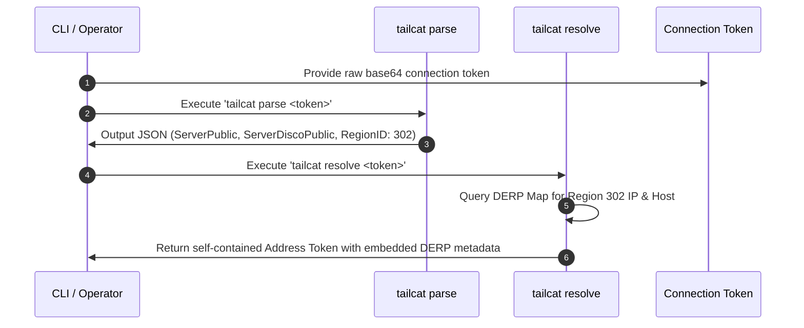
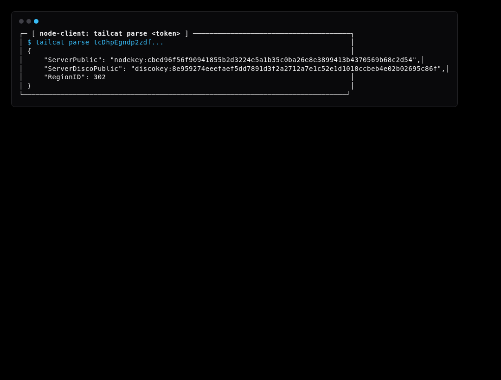
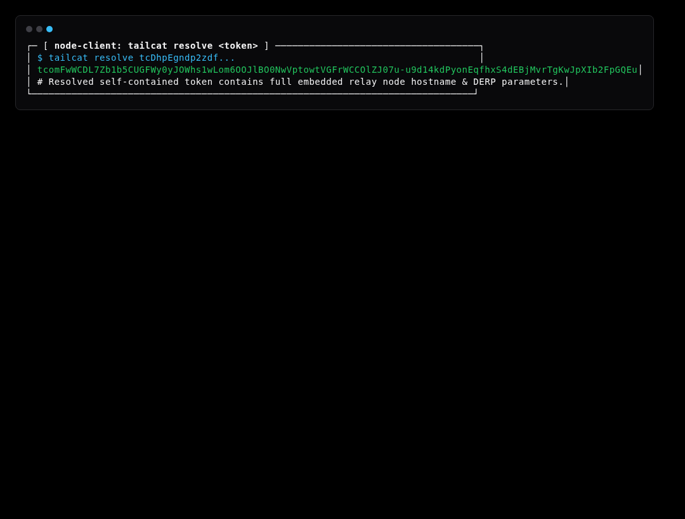

# Simulation Scenario 08: Token Parse & Address Resolution Simulation

Parses connection token contents to JSON and resolves short tokens into self-contained address tokens with embedded DERP relay node metadata.

> **UI Mapping**: OpenTUI **Tab 5: Diagnostics** (Token Parser) | Cordis Web Dashboard **`/?tab=diag`**  
> **Interactive Archify Visualizer**: [`docs/features/core/diagrams/simulation-arch.html`](../features/core/diagrams/simulation-arch.html) · [🌐 Live HTMLPreview](https://htmlpreview.github.io/?https://github.com/abdshomad/tailcat-tui-with-opentui/blob/main/docs/features/core/diagrams/simulation-arch.html)



---

## Step-by-Step Visual Walkthrough

### Step 1: Parse Token to JSON



---

### Step 2: Resolve Token with Embedded Relay Metadata




---

## Automated Execution
Run this individual scenario in the test environment:
```bash
./scripts/simulate.sh --scenario 08
```
