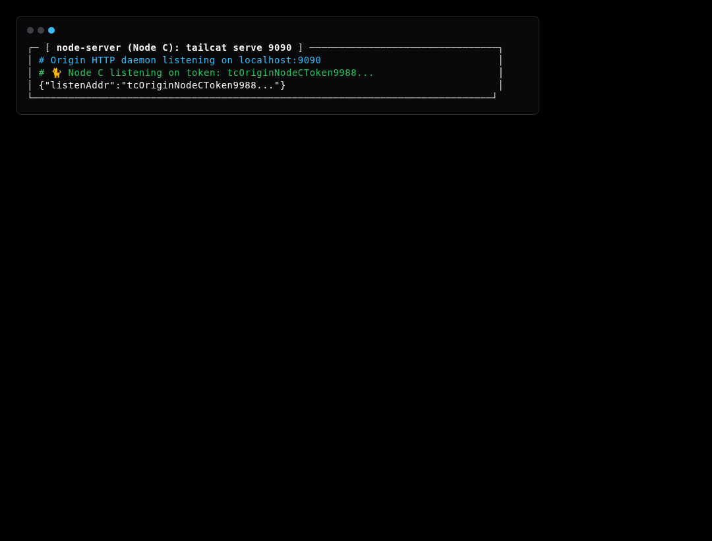
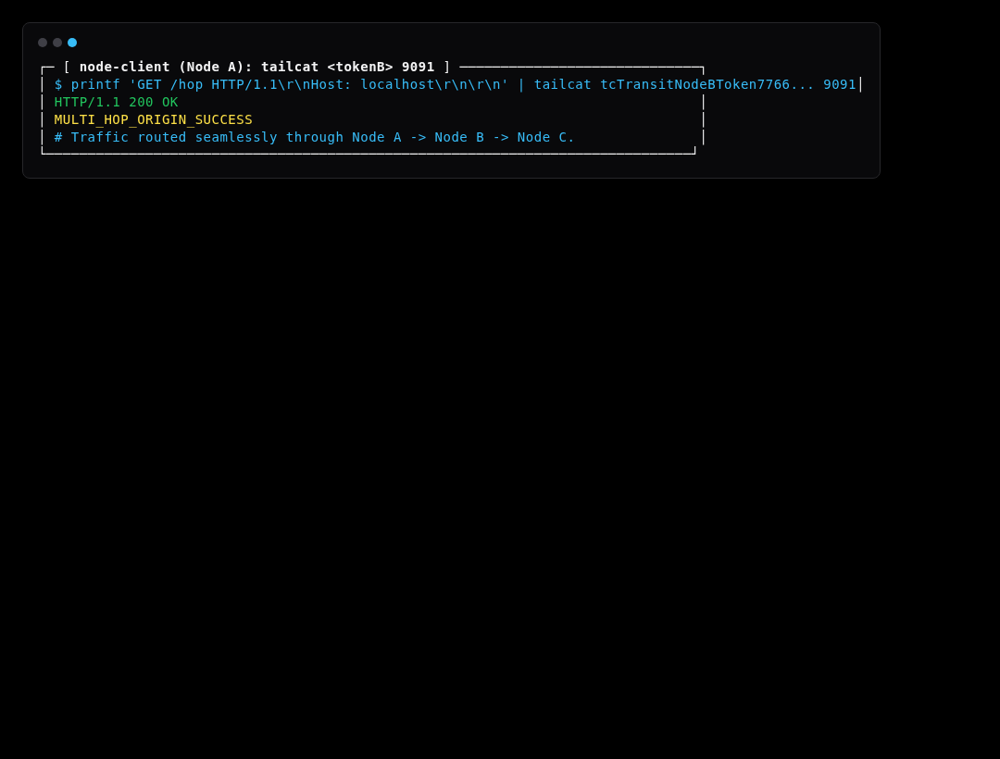

# Simulation Scenario 09: Multi-Hop Chained Tunnels & Transit Routing Simulation

Chains multiple WireGuard user-space tunnels across intermediate nodes (Node A -> Node B -> Node C) to traverse segmented private enclaves.

---

## Step-by-Step Visual Walkthrough

### Step 1: Origin Service & Node C Listener Startup



---

### Step 2: Intermediary Node B Transit Bridge


---

### Step 3: Node A Dials Multi-Hop Path




---

## Automated Execution
Run this individual scenario in the test environment:
```bash
./scripts/simulate.sh --scenario 09
```
