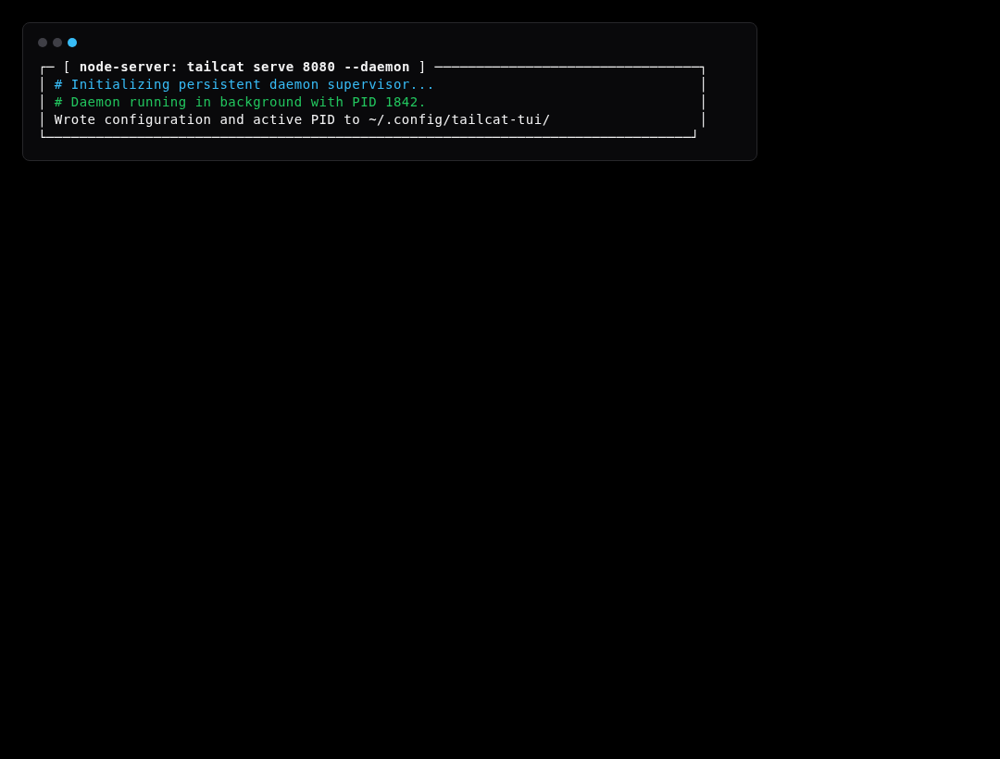
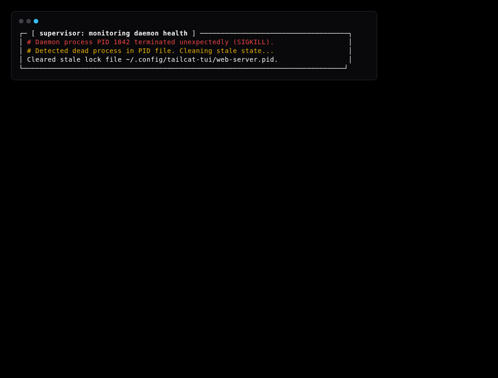

# Simulation Scenario 10: Daemon Lifecycle, Crash Resilience & Auto-Recovery Simulation

Validates daemon PID tracking, unexpected SIGKILL crash detection, stale PID file cleanup, and automated state restoration.

---

## Step-by-Step Visual Walkthrough

### Step 1: Persistent Daemon Startup



---

### Step 2: Sudden Crash & Stale State Detection



---

### Step 3: Auto-Recovery & Reconnection


---

## Automated Execution
Run this individual scenario in the test environment:
```bash
./scripts/simulate.sh --scenario 10
```
