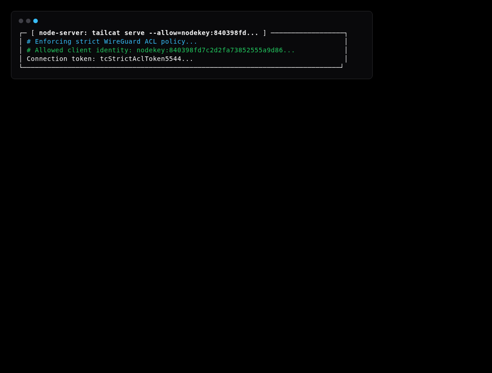
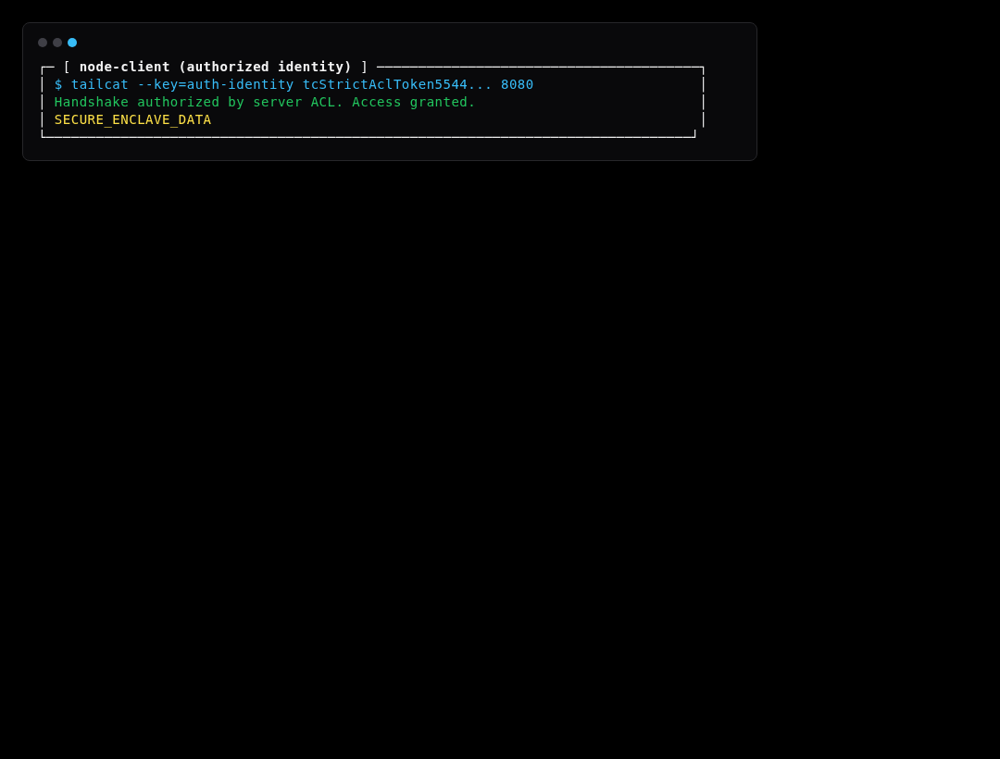
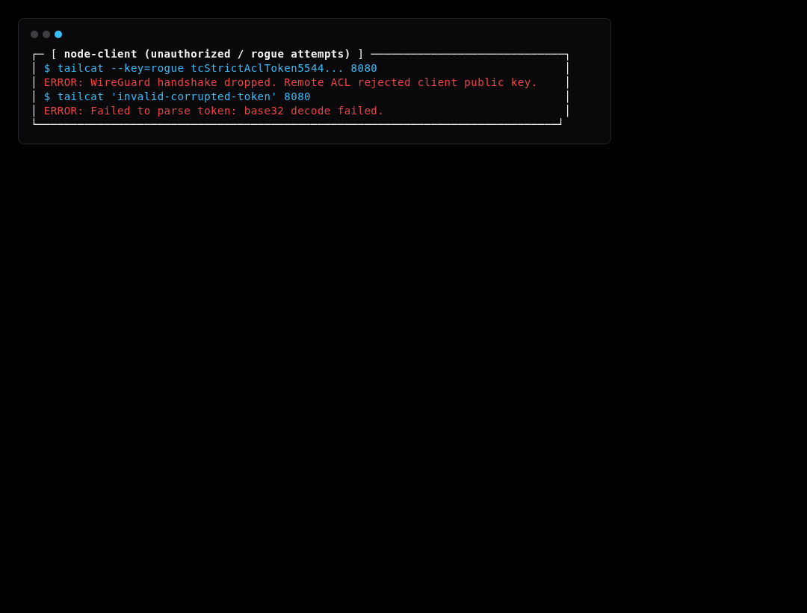

# Simulation Scenario 11: ACL Tag Security & Malformed Token Denial Simulation

Validates that strict WireGuard ACL policies (--allow=nodekey:...) block unauthorized peers and corrupted tokens are rejected.

---

## Step-by-Step Visual Walkthrough

### Step 1: Strict Server ACL Configuration



---

### Step 2: Authorized Client Connection



---

### Step 3: Rogue Identity & Corrupted Token Blocked




---

## Automated Execution
Run this individual scenario in the test environment:
```bash
./scripts/simulate.sh --scenario 11
```
