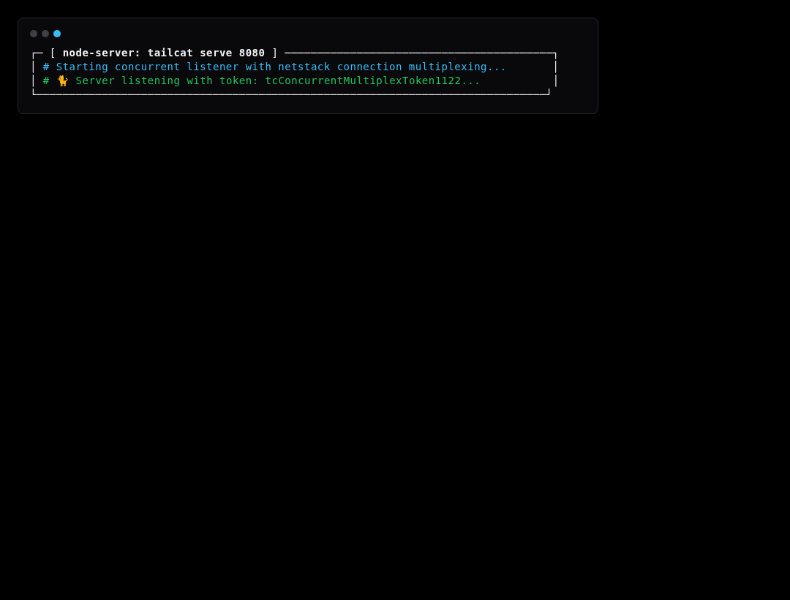
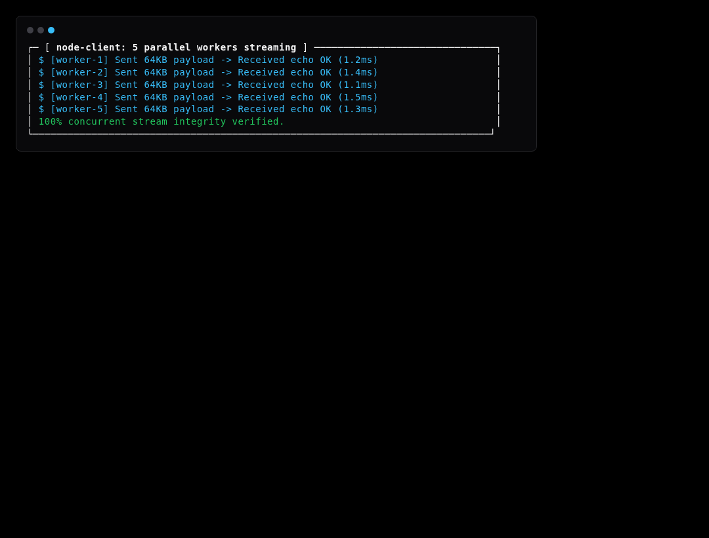
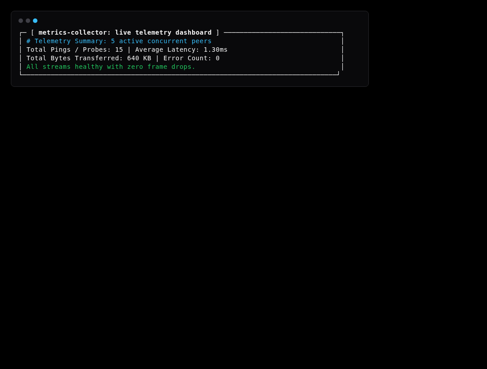

# Simulation Scenario 12: High-Concurrency Multi-Stream & Metrics Simulation

Spawns multiple parallel worker streams over concurrent tunnels to benchmark throughput, zero packet loss, and live telemetry tracking.

---

## Step-by-Step Visual Walkthrough

### Step 1: Concurrent High-Capacity Server Listener



---

### Step 2: Parallel Client Stream Workers



---

### Step 3: Metrics & Telemetry Aggregation




---

## Automated Execution
Run this individual scenario in the test environment:
```bash
./scripts/simulate.sh --scenario 12
```
