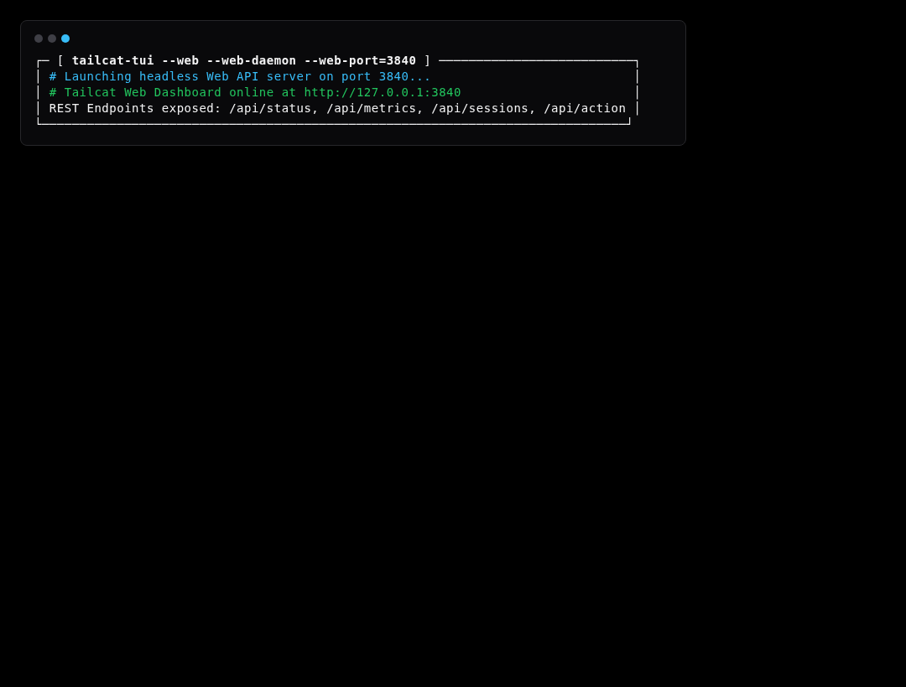
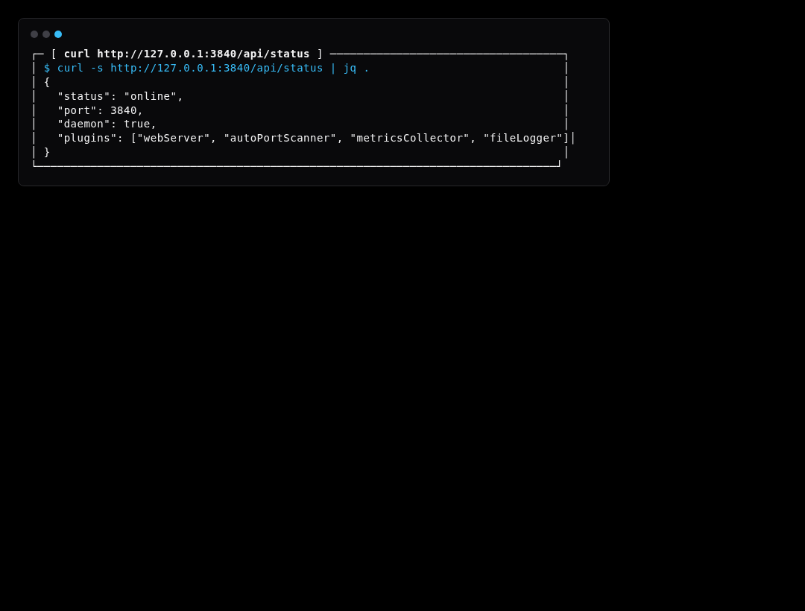
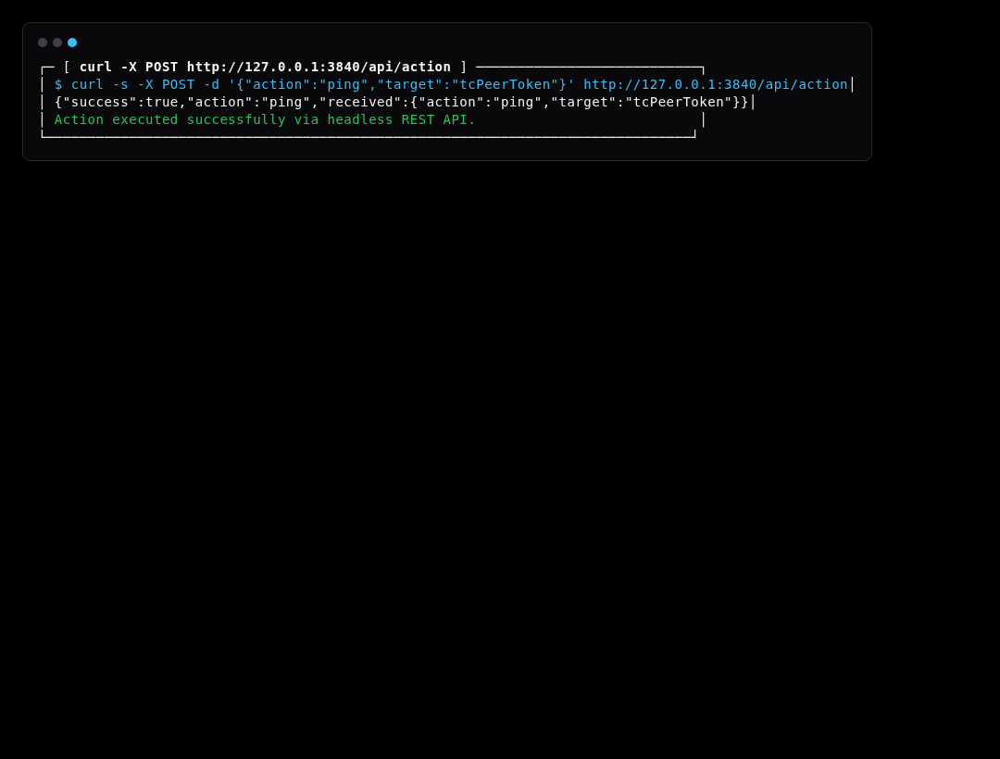

# Simulation Scenario 13: Web Server Headless Mode & Remote API Control Simulation

Controls Tailcat services headlessly over HTTP REST and telemetry endpoints without requiring interactive terminal TUI.

---

## Step-by-Step Visual Walkthrough

### Step 1: Headless Web Server Startup



---

### Step 2: Probe Status & Telemetry via curl



---

### Step 3: Trigger Service Actions via POST API




---

## Automated Execution
Run this individual scenario in the test environment:
```bash
./scripts/simulate.sh --scenario 13
```
