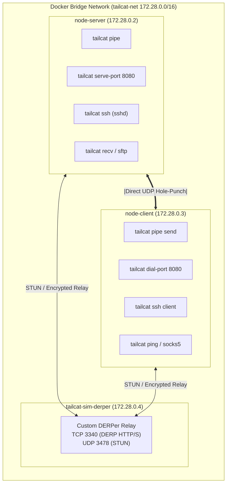

# Tailcat Multi-Node Network Simulation Visual Guide

This documentation provides comprehensive step-by-step visual walkthroughs for all 8 networking scenarios described in [tailcat/README.md](../../tailcat/README.md), simulated across isolated multi-node Docker containers.

## 🏗️ Multi-Node Simulation Topology

> **Interactive Archify Visualizer**: [`docs/features/core/diagrams/simulation-arch.html`](../features/core/diagrams/simulation-arch.html) · [🌐 Live HTMLPreview](https://htmlpreview.github.io/?https://github.com/abdshomad/tailcat-tui-with-opentui/blob/main/docs/features/core/diagrams/simulation-arch.html)  
> **Unified System Architecture**: [`docs/features/core/diagrams/tui-web-arch.html`](../features/core/diagrams/tui-web-arch.html) · [🌐 Live HTMLPreview](https://htmlpreview.github.io/?https://github.com/abdshomad/tailcat-tui-with-opentui/blob/main/docs/features/core/diagrams/tui-web-arch.html)



---

## Scenario Index & UI Mapping

| # | Scenario Name | Documentation | OpenTUI View | Web Route | Description |
| :---: | :--- | :---: | :---: | :---: | :--- |
| **01** | Pipe & Raw Stream | [01-pipe-stream.md](./01-pipe-stream.md) | Tab 1: Pipe / Stream | `/?tab=pipe` | Raw bidirectional stream transmission between listener and payload sender over WireGuard/DERP. |
| **02** | Port Forwarding (8080) | [02-port-forward.md](./02-port-forward.md) | Tab 2: Ports | `/?tab=ports` | Exposes local HTTP service on port 8080 through the tunnel, dialed directly by remote client. |
| **03** | Auth-Free SSH Server | [03-auth-free-ssh.md](./03-auth-free-ssh.md) | Tab 3: SSH | `/?tab=ssh` | Spawns userspace auth-free SSH daemon without inbound firewall ports and runs remote commands. |
| **04** | Files, Drop Box & SFTP | [04-file-sftp.md](./04-file-sftp.md) | Tab 4: Files | `/?tab=files` | Write-only drop box receiver (`tailcat recv /inbox`) and SFTP directory server (`tailcat serve files`). |
| **05** | Diagnostics & Ping | [05-ping-diagnostics.md](./05-ping-diagnostics.md) | Tab 5: Diagnostics | `/?tab=diag` | Probes peer latency and validates DERP relay paths vs direct peer-to-peer UDP punch. |
| **06** | SOCKS5 Proxy Runner | [06-socks5-proxy.md](./06-socks5-proxy.md) | Tab 5: Proxy Runner | `/?tab=diag` | Routes arbitrary CLI commands (like curl) through a transient userspace SOCKS5 proxy tunnel. |
| **07** | Key Management & ACL | [07-key-management-acl.md](./07-key-management-acl.md) | Tab 6: Keys | `/?tab=keys` | Restricts server access to approved client public keys (`--allow=nodekey:...`) and blocks rogue peers. |
| **08** | Token Parse & Resolve | [08-token-parse-resolve.md](./08-token-parse-resolve.md) | Tab 5: Token Parser | `/?tab=diag` | Parses connection token contents to JSON and resolves self-contained address tokens with DERP metadata. |

---

## Running All Simulations
To execute all simulation scenarios in Docker Compose:
```bash
npm run test:simulation
# Or via CLI runner:
./scripts/simulate.sh --all
```
