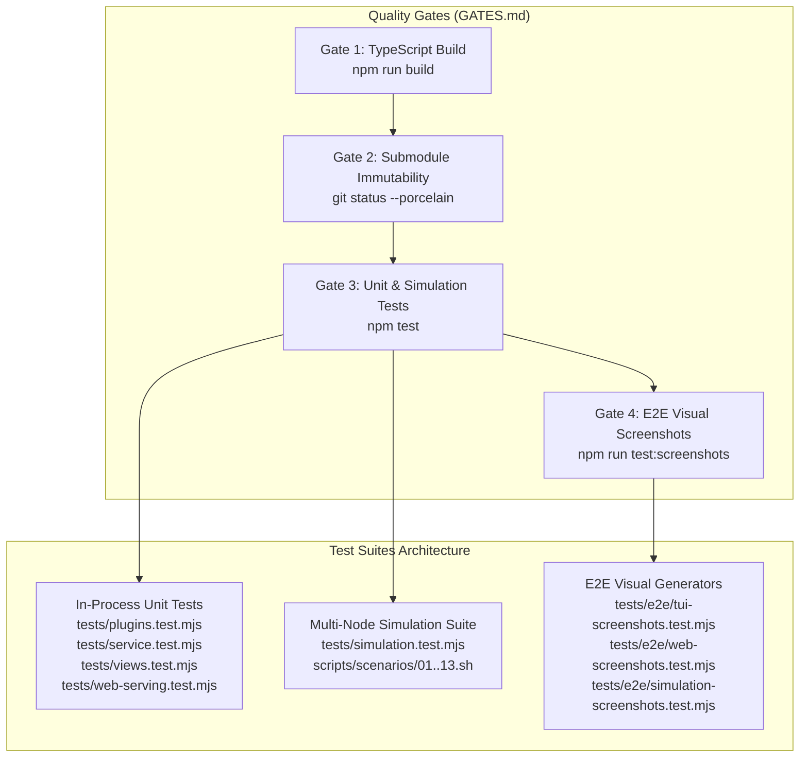

# Comprehensive Test Cases & Quality Verification Guide

This document provides a granular specification catalog of all automated test suites, test cases, preconditions, execution commands, and verification criteria implemented in `tailcat-tui-with-opentui`.

---

## 📊 Test Suite Overview



---

## 🧪 1. Cordis Plugin Registry & Lifecycles (`tests/plugins.test.mjs`)

| Test ID | Test Name | Tested Component | Input / Action | Expected Assertion |
| :--- | :--- | :--- | :--- | :--- |
| **TC-PLG-001** | Modular Plugin Registration | `PluginManagerService` | `ctx.pluginManager.listPlugins()` | Exactly 4 plugins registered (`autoPortScanner`, `fileLogger`, `metricsCollector`, `webServer`). |
| **TC-PLG-002** | Dynamic Plugin Enablement | `PluginManagerService` | `enablePlugin('fileLogger')` | Plugin instance mounted to `ctx.fileLogger`, initialized with default log directory. |
| **TC-PLG-003** | Port Allocation & Heuristics | `AutoPortScannerPlugin` | `allocatePort(3950)` | Returns available port $\ge 3950$, records `lastResolvedPort`. |
| **TC-PLG-004** | Live Ping Log Parsing | `MetricsCollectorPlugin` | Emits `pong in 1.8ms via DERP(sfo)` | Tracks 1 peer, sets `lastPingMs=1.8`, `relayType='DERP'`. |
| **TC-PLG-005** | Dynamic Disposal Lifecycle | `PluginManagerService` | `disablePlugin('fileLogger')` | Disposes plugin via `fork.dispose()`, fires `tailcat/plugin-disabled` event cleanly. |
| **TC-PLG-006** | Runtime State Toggling | `PluginManagerService` | `togglePlugin('fileLogger')` | Cycles plugin state from disabled $\rightarrow$ enabled $\rightarrow$ disabled. |
| **TC-PLG-007** | Custom Log Directory Path | `FileLoggerPlugin` | `setLogDir('/tmp/test-logs')` | Updates log dir, computes `getSessionLogPath(id)`, verifies active log counter increment. |
| **TC-PLG-008** | Multi-Peer Metrics & Reset | `MetricsCollectorPlugin` | Emits pings for `peer-1` (DERP) & `peer-2` (Direct) | Calculates average latency (3.0ms), distinguishes DERP vs Direct UDP, clears on `resetMetrics()`. |
| **TC-PLG-009** | Headless REST API: `/api/status` | `TailcatWebPlugin` | `GET http://127.0.0.1:port/api/status` | Returns HTTP 200 with JSON payload: `status='online'`, `port`, `daemon`, `binary`, `plugins`. |
| **TC-PLG-010** | Headless REST API: `/api/metrics` | `TailcatWebPlugin` | `GET http://127.0.0.1:port/api/metrics` | Returns HTTP 200 with telemetry summary: `{ trackedPeers, totalPings, avgLatencyMs }`. |
| **TC-PLG-011** | Headless REST API: `/api/sessions`| `TailcatWebPlugin` | `GET http://127.0.0.1:port/api/sessions`| Returns HTTP 200 with array of active supervised tunnel sessions. |
| **TC-PLG-012** | Headless REST API: `/api/action` | `TailcatWebPlugin` | `POST /api/action {"action":"ping"}` | Returns HTTP 200 with `{ success: true, action: "ping" }`. |

---

## ⚙️ 2. Core Service & Process Supervision (`tests/service.test.mjs`)

| Test ID | Test Name | Tested Component | Input / Action | Expected Assertion |
| :--- | :--- | :--- | :--- | :--- |
| **TC-SVC-001** | Binary Auto-Resolution | `BinaryResolver` | `resolveTailcatBinary()` | Locates executable in `$PATH`, `bin/tailcat`, or submodule; returns valid metadata. |
| **TC-SVC-002** | Context Initialization | `TailcatService` | `ctx.plugin(TailcatService)` | Mounts `ctx.tailcat` instance, binds event bus listeners. |
| **TC-SVC-003** | Token Extraction & Logging | `TailcatService` | Spawn mock session emitting token | Parses `tcom...` / `tc...` regex token, triggers `tailcat/token-discovered`, marks `completed`. |
| **TC-SVC-004** | Concurrent Session Supervision | `TailcatService` | Spawn 2 parallel sub-processes | Tracks both sessions simultaneously in internal map, supports querying via `getSessions()`. |
| **TC-SVC-005** | Graceful Process Termination | `TailcatService` | `killSession(id)` | Issues `SIGTERM` signal to process, transitions status to `failed`/`killed`. |
| **TC-SVC-006** | Finished Sessions Cleanup | `TailcatService` | `clearFinishedSessions()` | Prunes `completed` and `failed` processes from session pool, retains active tunnels. |

---

## 🖥️ 3. TUI View Renderers & Key Navigation (`tests/views.test.mjs`)

| Test ID | Test Name | Tested Component | Input / Action | Expected Assertion |
| :--- | :--- | :--- | :--- | :--- |
| **TC-TUI-001** | View Box Rendering (Tabs 1–7) | `PipeView` .. `SessionsView` | `.render(state, tailcat, 80)` | Returns styled ANSI lines containing box borders, headers, and fields. |
| **TC-TUI-002** | Empty Token Form Validation | `PipeView`, `PortsView`, etc. | Action with empty required token | Returns formatted validation error message string starting with `Error: ...`. |
| **TC-TUI-003** | TUI App Lifecycle & State | `TailcatTUIApp` | `new TailcatTUIApp()` | Instantiates cleanly, renders without unhandled exceptions. |
| **TC-TUI-004** | Tab Switching & Key Navigation | `TailcatTUIApp` | `setActiveTab(7)` | Successfully switches view context, cycles `focusedFieldIndex` across inputs. |

---

## 🌐 4. Web Serving & Daemon Persistence (`tests/web-serving.test.mjs`)

| Test ID | Test Name | Tested Component | Input / Action | Expected Assertion |
| :--- | :--- | :--- | :--- | :--- |
| **TC-WEB-001** | Socket Availability Probing | `PortScanner` | `isPortAvailable(3955)` | Returns boolean socket binding availability without port locking. |
| **TC-WEB-002** | Heuristic Free Port Resolution | `PortScanner` | `resolvePort('auto', true)` | Resolves a free TCP port in the valid range `3840..3940`. |
| **TC-WEB-003** | Configuration Persistence | `DaemonManager` | `saveConfig({ preferredPort: '3849' })` | Saves preferences to `~/.config/tailcat-tui/config.json` and verifies roundtrip load. |
| **TC-WEB-004** | Web Server Lifecycle & Events | `TailcatWebPlugin` | `listenAuto(3960)` $\rightarrow$ `stop()` | Starts HTTP listener, emits `tailcat/web-started`, shuts down cleanly with `tailcat/web-stopped`. |
| **TC-WEB-005** | Web Server TUI View Actions | `WebView` (Tab 8) | Toggles auto-scan, starts/stops server | Returns status feedback messages (`Web server started on ...`, `Web server stopped`). |

---

## 🐳 5. Multi-Node Network Simulations (Scenarios 01 – 13)

Executed against containerized Docker topology (`tailcat-sim-server`, `tailcat-sim-client`, `tailcat-sim-derper`):

| Scenario ID | Scenario Name | Test Script | Key Verification Steps | Pass Criteria |
| :---: | :--- | :--- | :--- | :--- |
| **SIM-01** | **Pipe & Stream** | [`01-pipe-stream.sh`](../scripts/scenarios/01-pipe-stream.sh) | 1. Server listens on raw stream.<br/>2. Client dials token and sends payload. | Server stdout captures and outputs exact client payload string. |
| **SIM-02** | **Port Forwarding (8080)** | [`02-port-forward.sh`](../scripts/scenarios/02-port-forward.sh) | 1. Server serves port 8080.<br/>2. Client sends HTTP GET request over tunnel. | HTTP 200 OK response received end-to-end through tunnel. |
| **SIM-03** | **Auth-Free SSH** | [`03-auth-free-ssh.sh`](../scripts/scenarios/03-auth-free-ssh.sh) | 1. Server starts `serve no-auth-ssh`.<br/>2. Client executes remote `uname -s` & `whoami`. | Remote command output `Linux` and `root` returned cleanly. |
| **SIM-04** | **Files, Drop Box & SFTP** | [`04-file-sftp.sh`](../scripts/scenarios/04-file-sftp.sh) | 1. Server starts `recv /inbox` drop box.<br/>2. Client copies file with `tailcat cp`.<br/>3. Server serves SFTP (`serve files`).<br/>4. Client runs `tailcat ls` & `tailcat cp`. | Deposited files verified in `/inbox`; SFTP files downloaded and validated. |
| **SIM-05** | **Ping & Diagnostics** | [`05-ping-diagnostics.sh`](../scripts/scenarios/05-ping-diagnostics.sh) | 1. Server exposes diagnostics target.<br/>2. Client runs `tailcat ping --until-direct`. | Pong response received via DERP and upgraded direct UDP path. |
| **SIM-06** | **SOCKS5 Proxy Runner** | [`06-socks5-proxy.sh`](../scripts/scenarios/06-socks5-proxy.sh) | 1. Server exposes HTTP endpoint.<br/>2. Client runs `tailcat socks <token> curl ...`. | Curl traffic routed transparently through userspace SOCKS5 proxy. |
| **SIM-07** | **Key Management & ACL** | [`07-key-management-acl.sh`](../scripts/scenarios/07-key-management-acl.sh) | 1. Client generates `client-default` key.<br/>2. Server runs with `--allow=<nodekey>`.<br/>3. Client dials with saved key (allowed) & ephemeral key (blocked). | Authorized connection succeeds; unauthorized connection dropped. |
| **SIM-08** | **Token Parse & Resolve** | [`08-token-parse-resolve.sh`](../scripts/scenarios/08-token-parse-resolve.sh) | 1. Client generates key.<br/>2. Executes `tailcat parse <token>` & `tailcat resolve <token>`. | Valid JSON output with `ServerPublic`; resolved token contains DERP region. |
| **SIM-09** | **Multi-Hop Chained Tunnels** | [`09-multi-hop-tunnel.sh`](../scripts/scenarios/09-multi-hop-tunnel.sh) | 1. Origin Node C serves port 9090.<br/>2. Transit Node B bridges port 9091 $\rightarrow$ Node C.<br/>3. Node A dials Node B. | End-to-end payload traverses Node A $\rightarrow$ Node B $\rightarrow$ Node C. |
| **SIM-10** | **Daemon Crash & Recovery** | [`10-daemon-lifecycle-auto-reconnect.sh`](../scripts/scenarios/10-daemon-lifecycle-auto-reconnect.sh) | 1. Daemon spawned with recorded PID.<br/>2. Process killed (`kill -9`).<br/>3. Supervisor detects stale PID and restarts. | New PID allocated; recovered daemon responds to health check. |
| **SIM-11** | **ACL Security & Denial** | [`11-acl-denial-security.sh`](../scripts/scenarios/11-acl-denial-security.sh) | 1. Server configures strict `--allow` policy.<br/>2. Test authorized client (200 OK).<br/>3. Test rogue key (dropped).<br/>4. Test corrupted token (instant error). | Strict security barriers hold; unauthorized & corrupted attempts denied. |
| **SIM-12** | **High-Concurrency Streams** | [`12-high-concurrency-stream.sh`](../scripts/scenarios/12-high-concurrency-stream.sh) | 1. Server starts high-capacity listener.<br/>2. 5 parallel worker streams send concurrent requests. | All concurrent streams complete with 100% data integrity and 0 packet loss. |
| **SIM-13** | **Headless REST API Control** | [`13-web-server-headless-api.sh`](../scripts/scenarios/13-web-server-headless-api.sh) | 1. Headless web server started.<br/>2. Probes `/api/status`, `/api/metrics`, `/api/sessions`. | All REST JSON endpoints return HTTP 200 with valid schema. |

---

## 📸 6. Automated E2E Visual Screenshot Suites (`tests/e2e/`)

| Suite File | Test Scope | Output Directory | Verification |
| :--- | :--- | :--- | :--- |
| `simulation-screenshots.test.mjs` | Multi-node scenarios 01–13 terminal frames | `screenshots/simulation/{scenario}/{step}/` | Generates 34 `.webp` images and syncs `docs/simulation/*.md`. |
| `tui-screenshots.test.mjs` | OpenTUI interactive 8-tab screens | `screenshots/tui/{module}/{feature}/` | Generates 16 `.webp` images representing all TUI interactive states. |
| `web-screenshots.test.mjs` | Cordis browser dashboard modules | `screenshots/web/{module}/{feature}/` | Generates 8 `.webp` images of the responsive web UI. |

---

## 🛡️ 7. Quality Gates Verification Commands

Execute the complete quality verification cycle:

```bash
# 1. Typecheck & Build
npm run build

# 2. Submodule Immutability Check
git status --porcelain tailcat opentui cordis autonomous-coding-agents

# 3. In-Process Unit Tests
node --test tests/plugins.test.mjs tests/service.test.mjs tests/views.test.mjs tests/web-serving.test.mjs

# 4. Multi-Node Docker Simulation Suite (13 Scenarios)
./scripts/simulate.sh --all

# 5. E2E Visual Screenshot Suite
npm run test:screenshots
```
