# Tailcat TUI & Web Interface Visual Guide

This guide provides a comprehensive visual walkthrough comparing the **OpenTUI Terminal Interface** and the **Cordis Web Dashboard** across all Tailcat modules.

For multi-node container simulation walkthroughs, see the **[Multi-Node Simulation Visual Guide](simulation/README.md)**.  
For individual web module documentation, see the **[Web Dashboard Guide](web/README.md)**.

---

> [!NOTE]
> **Client Tools vs. Server Daemons**:
> * The **Cordis Web Dashboard** focuses on **inbound server daemon configuration** and **process supervision**.
> * The **OpenTUI Terminal Interface** and **Simulation Suites** support full **bidirectional operations**, including interactive client-side execution (e.g., *Remote Port Dialer*, *SSH Client Connect*, *Payload Streamer*, and *SOCKS5 Runner*) which require direct TTY, PTY, or local TCP socket bindings.

---

## 🏗️ Visual Asset Pipeline & Screenshot Mechanics

All visual screenshots in this repository are 100% automated and deterministic.

> **Interactive Archify Diagram**: [`docs/features/core/diagrams/tui-web-arch.html`](features/core/diagrams/tui-web-arch.html) (Live flow simulation and subsystem explorer)

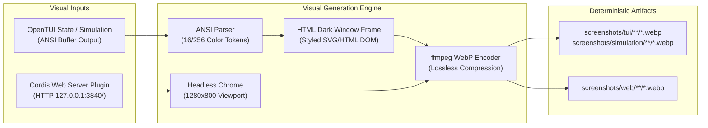

### 1. File & Directory Hierarchy
* `screenshots/tui/{module}/{feature}/{step-number}-{slug}.webp`: OpenTUI terminal interface screens.
* `screenshots/web/{module}/{feature}/01-{slug}.webp`: Cordis web dashboard views.
* `screenshots/simulation/{scenario}/{step-slug}/{step-number}-{step-slug}.webp`: Docker simulation multi-node steps.

### 2. Rendering Engines
* **TUI & Simulation**: Rendered through [`TerminalScreenshot`](../src/utils/terminal-screenshot.ts). Parses 16/256 ANSI escape codes into styled CSS spans embedded in an SVG/HTML terminal window frame.
* **Web Dashboard**: Rendered through [`WebScreenshot`](../src/utils/web-screenshot.ts). Spawns `google-chrome --headless=new --window-size=1280,800` against an active Cordis web instance and converts PNG to WebP via `ffmpeg`.

---

## 1. Pipe & Raw Stream

Create raw bidirectional data streams over Tailscale's WireGuard/DERP data plane for piping data, terminal chat, or arbitrary I/O between peers.

| OpenTUI Terminal Interface | Cordis Web Dashboard |
| :---: | :---: |
|  |  |
| **Client Payload Sender** | |
| 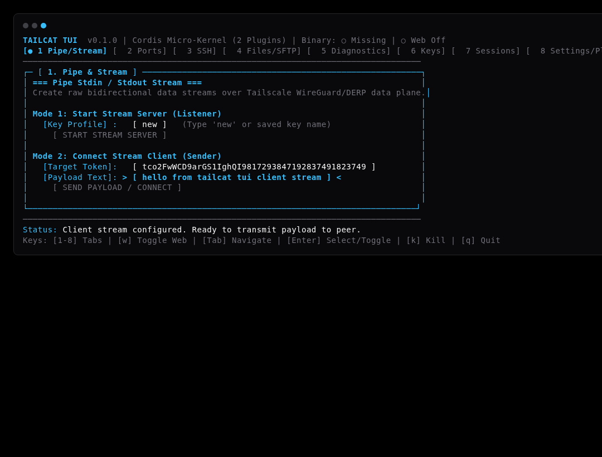 | |

---

## 2. Ports & Tunnels

Expose local TCP ports (e.g., `8080`, `8443`, or `all`) to remote peers or connect to remote ports without modifying system routing tables or firewalls.

| OpenTUI Terminal Interface | Cordis Web Dashboard |
| :---: | :---: |
|  |  |
| **Remote Port Dialer** | |
| 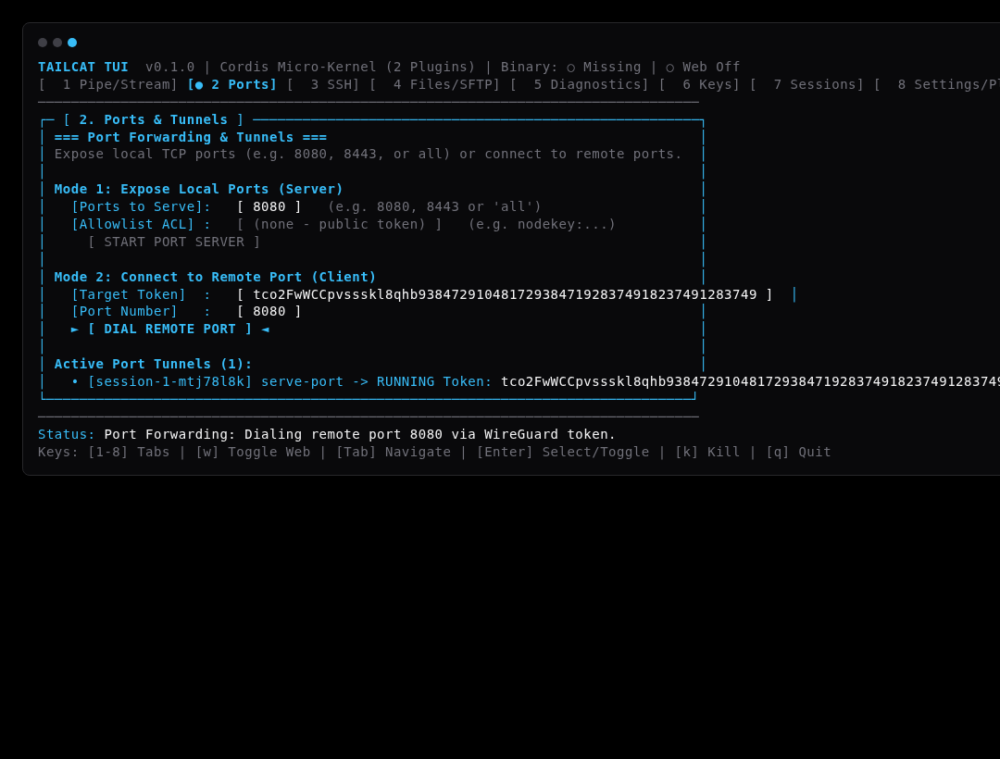 | |

---

## 3. SSH Server & Client

Auth-free or WireGuard-ACL protected SSH access directly over userspace tunnels without open inbound firewall ports.

| OpenTUI Terminal Interface | Cordis Web Dashboard |
| :---: | :---: |
|  |  |
| **SSH Client Connect** | |
| 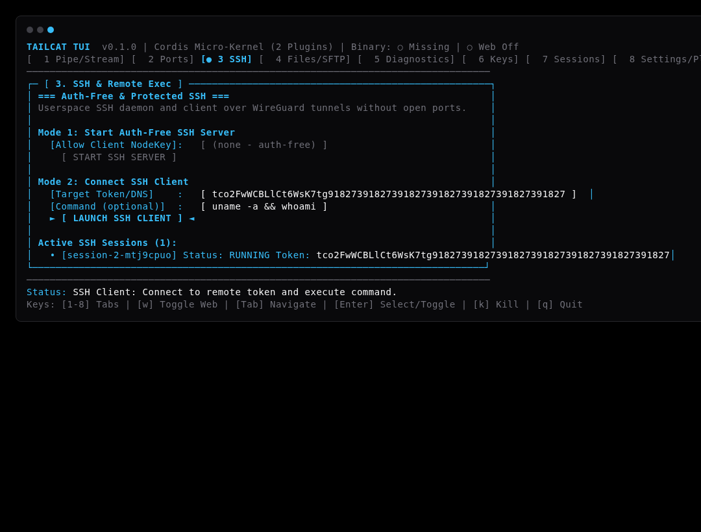 | |

---

## 4. Files & SFTP Transfers

Secure drop box inbox (`tailcat recv`), SFTP directory serving (`tailcat serve files`), remote file copy (`tailcat cp`), and directory listing (`tailcat ls`).

| OpenTUI Terminal Interface | Cordis Web Dashboard |
| :---: | :---: |
| 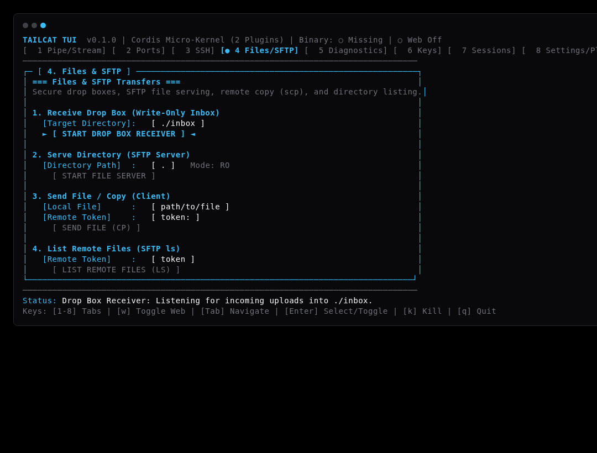 |  |
| **SFTP Directory Server** | |
| 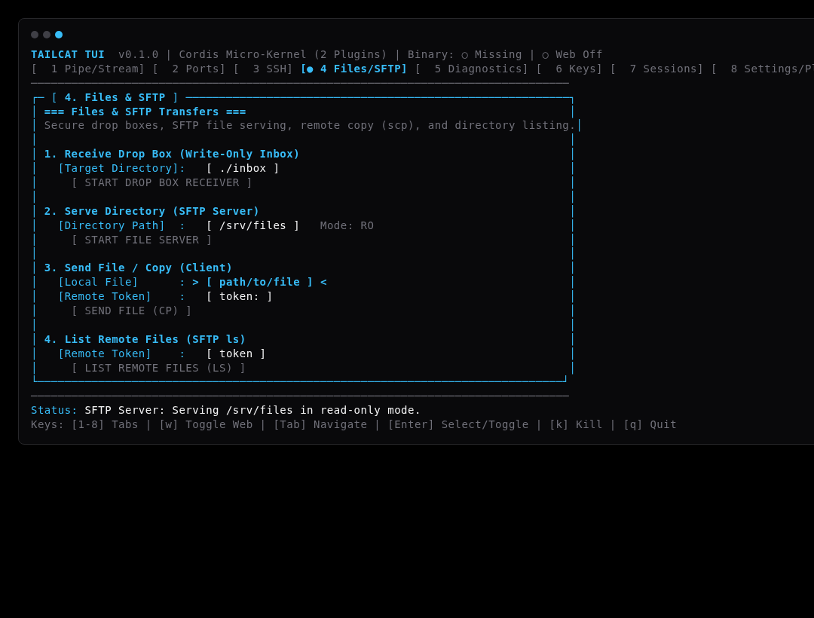 | |

---

## 5. Network Diagnostics & Tunnels

Ping peers via DERP relay vs direct UDP paths, route arbitrary commands through a userspace SOCKS5 proxy, or parse/resolve address tokens.

| OpenTUI Terminal Interface | Cordis Web Dashboard |
| :---: | :---: |
| 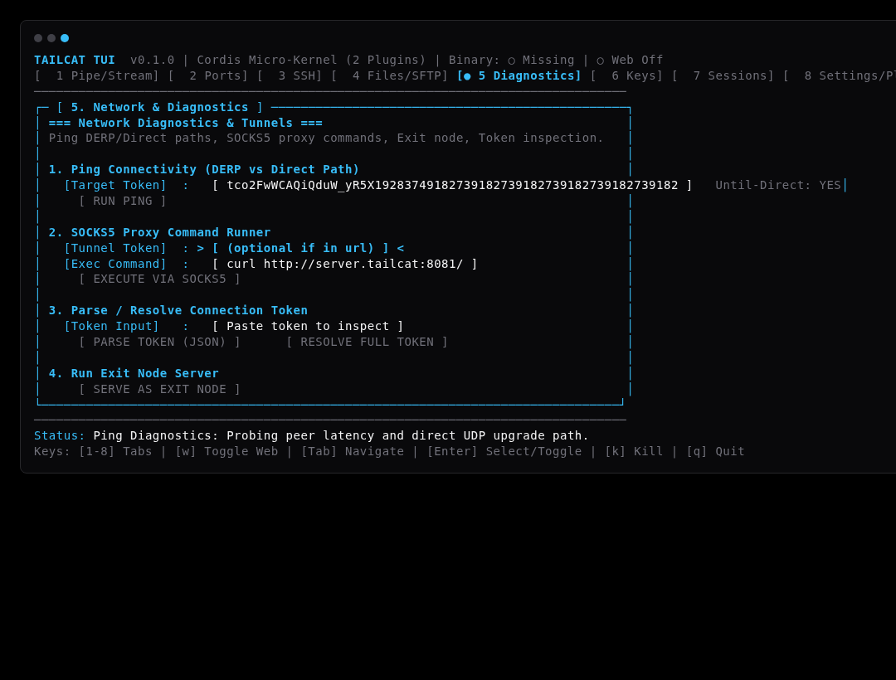 |  |
| **SOCKS5 Proxy Command Runner** | |
| 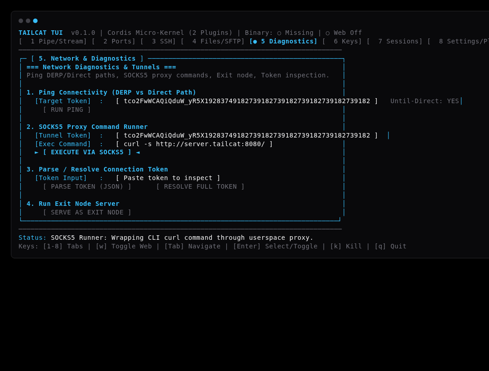 | |
| **Token Parser & Resolver** | |
| 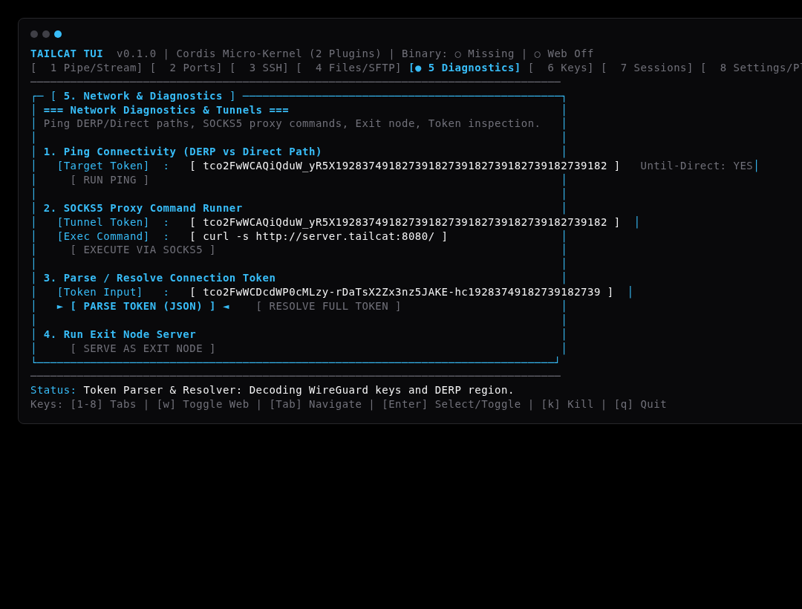 | |

---

## 6. Key Management & Relays

Generate WireGuard keypairs, manage saved identity profiles (`default`, custom), issue client authentication keys, and configure custom DERP relay regions.

| OpenTUI Terminal Interface | Cordis Web Dashboard |
| :---: | :---: |
| 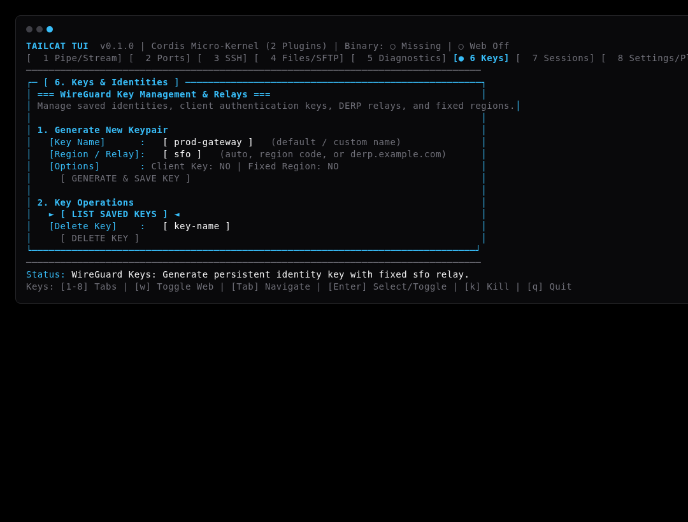 |  |
| **Client Identity Keys** | |
| 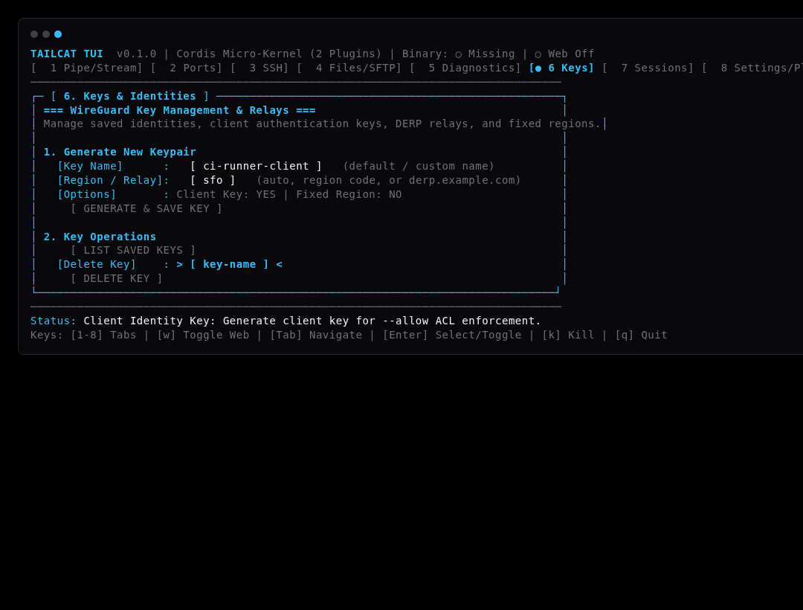 | |

---

## 7. Active Sessions & Process Supervisor

Live process supervisor monitoring background tunnels, streaming real-time stdout/stderr logs, and providing one-key termination (`k`).

| OpenTUI Terminal Interface | Cordis Web Dashboard |
| :---: | :---: |
|  |  |

---

## 8. Settings & Cordis Plugin Manager

Manage the Cordis micro-kernel dynamic plugin registry (`webServer`, `fileLogger`, `autoPortScanner`, `metricsCollector`), toggle runtime lifecycles with immediate disposal (`fork.dispose()`), auto-scan available TCP ports, save startup preferences to `~/.config/tailcat-tui/config.json`, or detach as a background daemon.

| OpenTUI Settings Controls | OpenTUI Plugin Registry View |
| :---: | :---: |
|  |  |

---

## 9. Multi-Node Simulation Network Scenarios (13 Scenarios)

All 13 networking scenarios from basic pipe streaming to multi-hop transit routing, daemon auto-recovery, and high-concurrency tunnels are simulated across isolated multi-node Docker containers:

| Scenario 9: Multi-Hop Transit Bridge | Scenario 10: Daemon Crash Recovery |
| :---: | :---: |
| 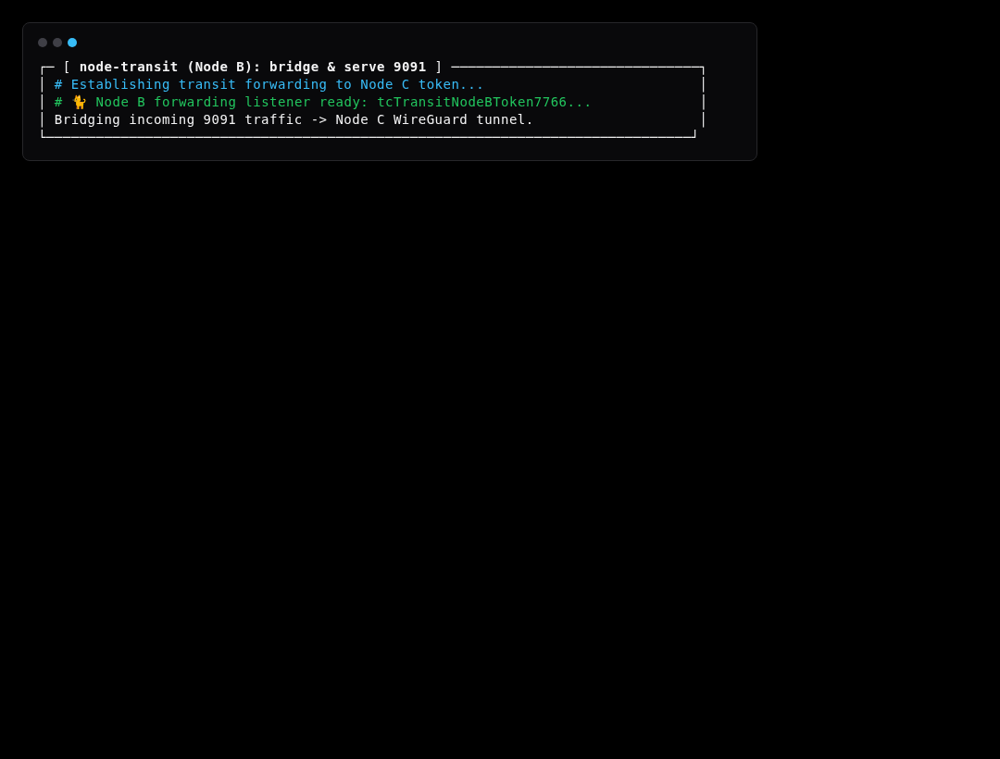 | 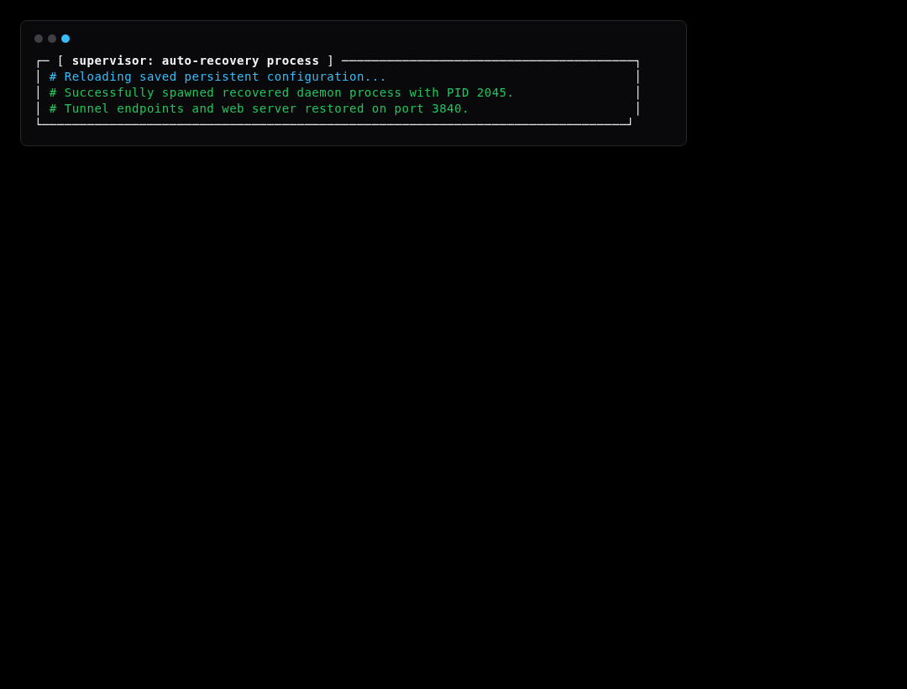 |

| Scenario 11: ACL Security Enforcement | Scenario 12: High-Concurrency Multiplex |
| :---: | :---: |
|  |  |

* Detailed individual scenario guides: **[docs/simulation/README.md](simulation/README.md)**.

---

## 10. Headless REST API & Telemetry Endpoints

The web server plugin exposes JSON REST endpoints for headless remote monitoring and control:

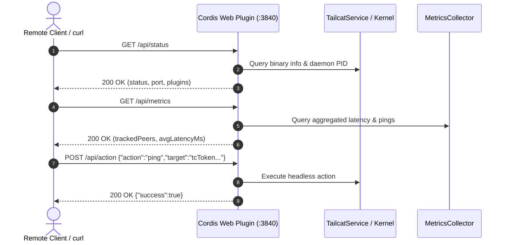

---

## 🧪 Re-generating All Visuals

To regenerate all screenshots and markdown guides:
```bash
npm run test:screenshots
```
