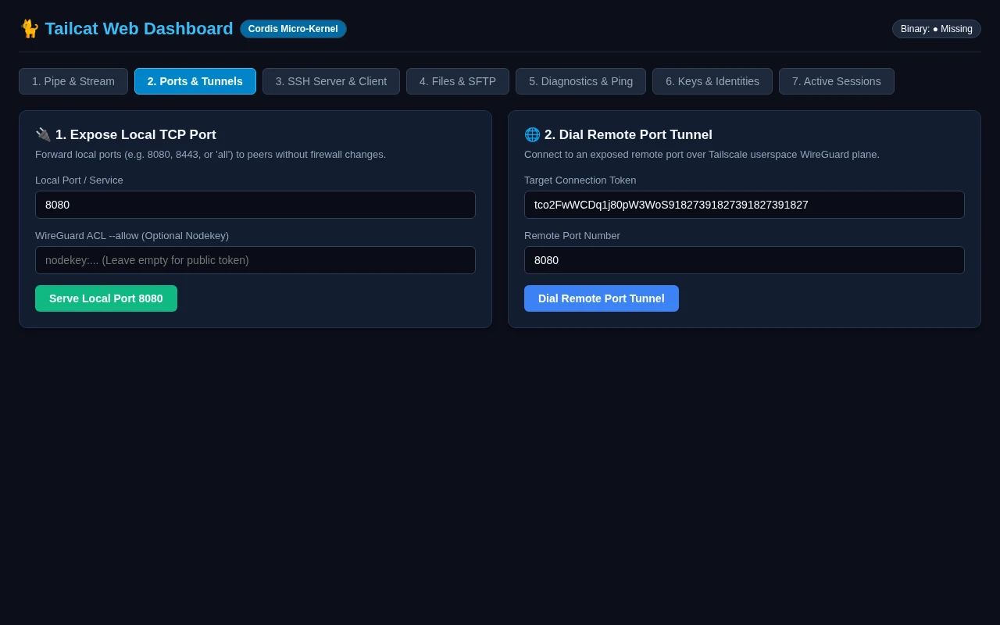

# Web Dashboard: Ports & Tunnels

Expose local TCP ports (8080, 8443, or all) to remote peers through userspace tunnels without altering firewall or routing tables.

> **OpenTUI Mapping**: Tab 02 | **Cordis Route**: `/?tab=ports`  
> **Interactive Archify Visualizer**: [`docs/features/core/diagrams/web-arch.html`](../features/core/diagrams/web-arch.html) · [🌐 Live HTMLPreview](https://htmlpreview.github.io/?https://github.com/abdshomad/tailcat-tui-with-opentui/blob/main/docs/features/core/diagrams/web-arch.html)

```mermaid
flowchart LR
    Browser["Browser Client (/?tab=ports)"] -->|POST /api/ports/serve| WebPlugin["TailcatWebPlugin (3840)"]
    WebPlugin --> Scanner["AutoPortScannerPlugin"]
    WebPlugin --> TailcatSvc["TailcatService"]
    TailcatSvc --> Proc["tailcat serve-port"]
    Proc -.-> Net["Userspace TCP Netstack"]
    Browser -.->|GET /api/sessions (poll)| WebPlugin
```

---

## Visual Walkthrough



---

## Module Controls & Details
* **Route**: `/?tab=ports`
* **Purpose**: Expose local TCP ports (8080, 8443, or all) to remote peers through userspace tunnels without altering firewall or routing tables.
* **Supervised Sessions**: Tunnels launched through this interface appear immediately in the Active Sessions monitor table.
