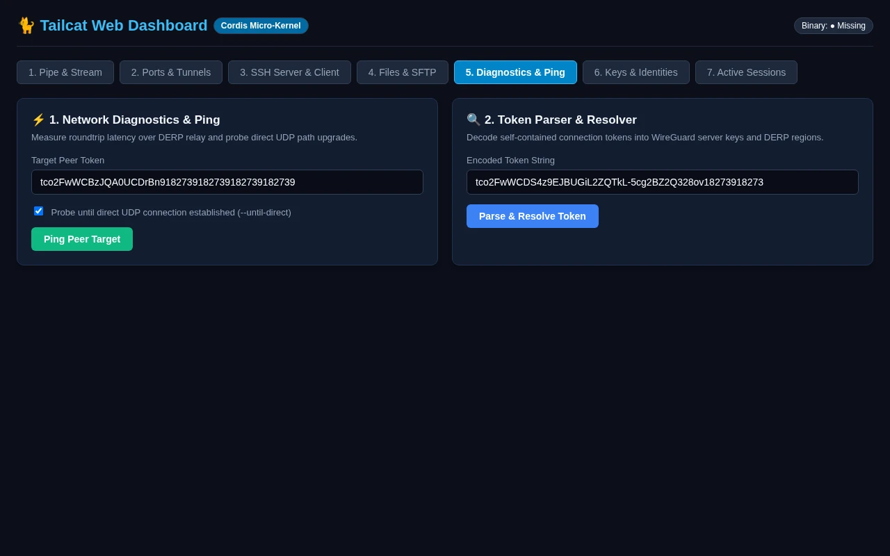

# Web Dashboard: Network Diagnostics & Ping

Inspect network latency and DERP relay vs direct UDP paths across Tailcat peers.

> **OpenTUI Mapping**: Tab 05 (`DiagnosticsView`) | **Cordis Route**: `/?tab=diag`  
> **Interactive Archify Visualizer**: [`docs/features/core/diagrams/web-arch.html`](../features/core/diagrams/web-arch.html) · [🌐 Live HTMLPreview](https://htmlpreview.github.io/?https://github.com/abdshomad/tailcat-tui-with-opentui/blob/main/docs/features/core/diagrams/web-arch.html)

```mermaid
flowchart LR
    Browser["Browser Client (/?tab=diag)"] -->|POST /api/ping| WebPlugin["TailcatWebPlugin (3840)"]
    WebPlugin --> Metrics["MetricsCollectorPlugin"]
    WebPlugin --> TailcatSvc["TailcatService"]
    TailcatSvc --> Proc["tailcat ping / token"]
    Proc -.-> Net["DERP & Direct UDP Telemetry"]
    Browser -.->|GET /api/metrics (poll)| WebPlugin
```

---

## Visual Walkthrough



---

## Module Controls & Details
* **Route**: `/?tab=diag`
* **Purpose**: Inspect network latency and DERP relay vs direct UDP paths across Tailcat peers.
* **Supervised Sessions**: Tunnels launched through this interface appear immediately in the Active Sessions monitor table.
