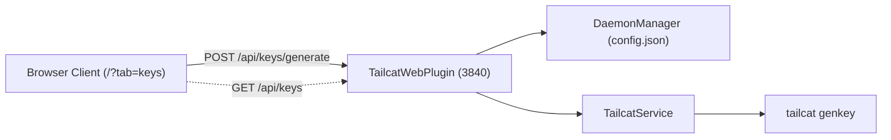
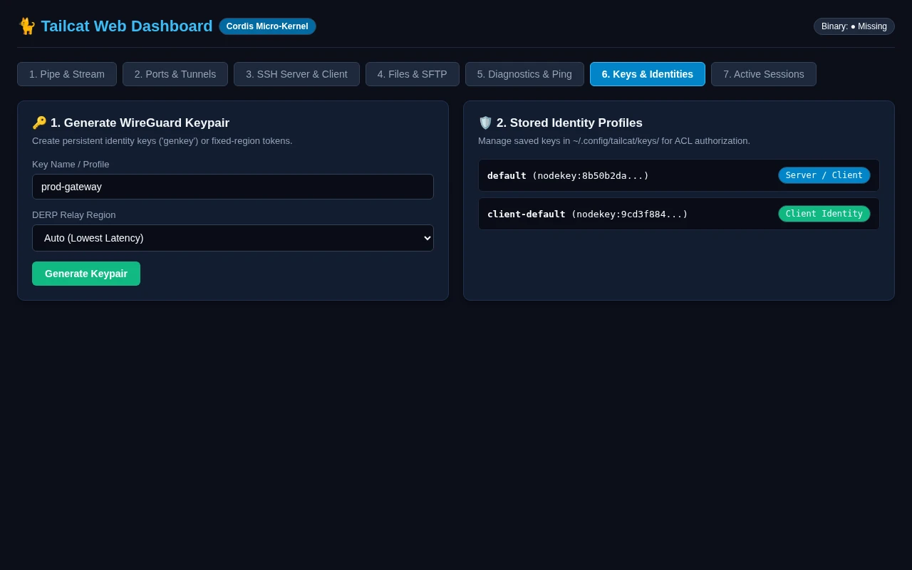

# Web Dashboard: Key Management & Identities

Manage persistent WireGuard identity keypairs, generate stable tokens, and configure custom DERP relays.

> **OpenTUI Mapping**: Tab 06 (`KeysView`) | **Cordis Route**: `/?tab=keys`  
> **Interactive Archify Visualizer**: [`docs/features/core/diagrams/web-arch.html`](../features/core/diagrams/web-arch.html) · [🌐 Live HTMLPreview](https://htmlpreview.github.io/?https://github.com/abdshomad/tailcat-tui-with-opentui/blob/main/docs/features/core/diagrams/web-arch.html)

---

## Visual Walkthrough

---

## Module Controls & Details
* **Route**: `/?tab=keys`
* **Purpose**: Manage persistent WireGuard identity keypairs, generate stable tokens, and configure custom DERP relays.
* **Supervised Sessions**: Tunnels launched through this interface appear immediately in the Active Sessions monitor table.
