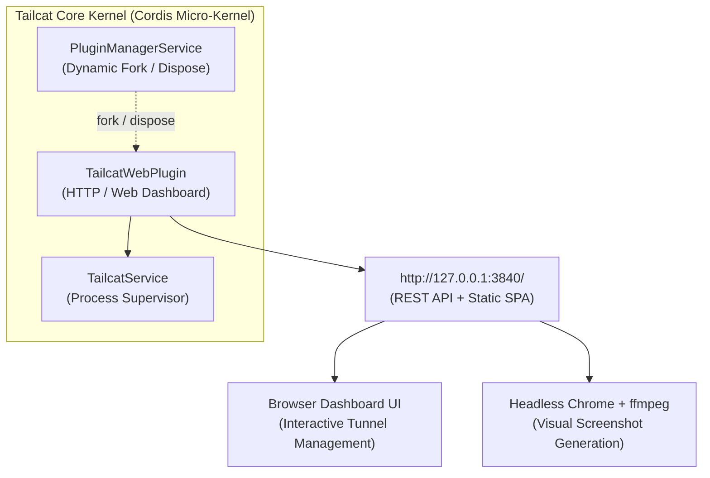
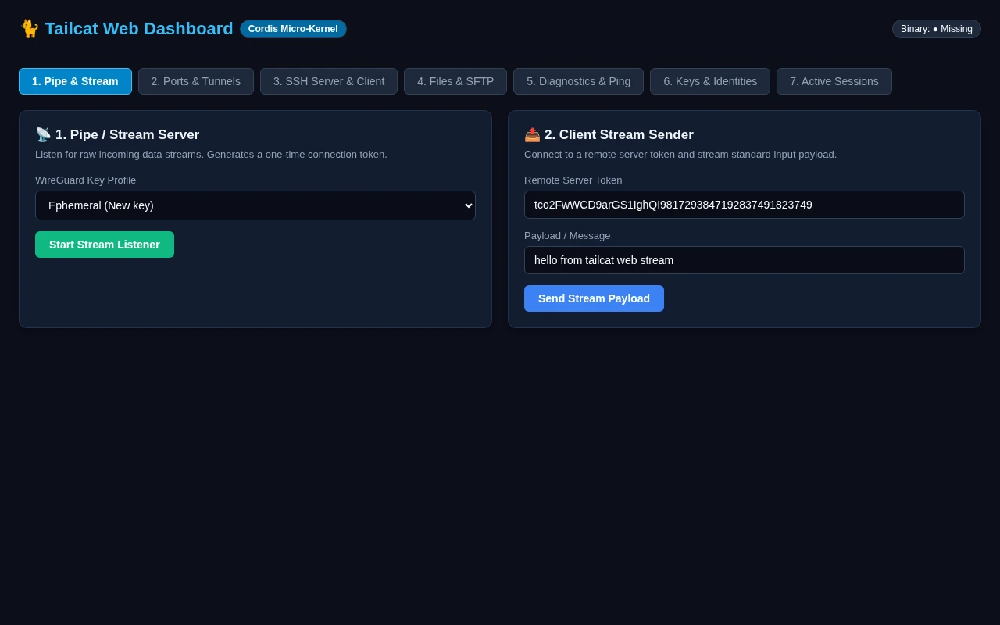
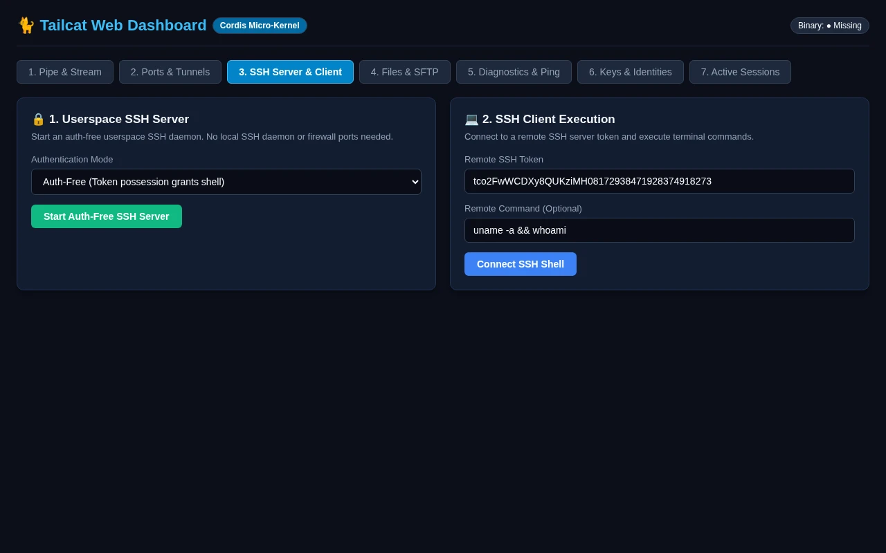
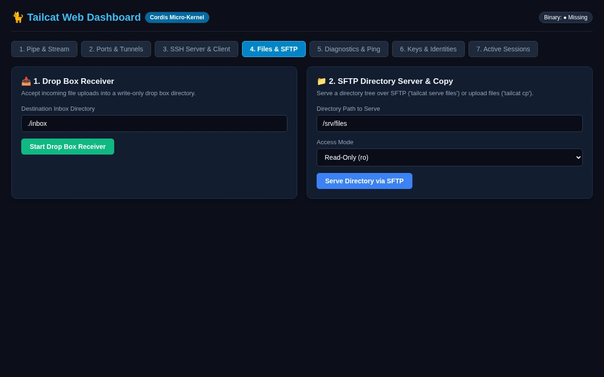
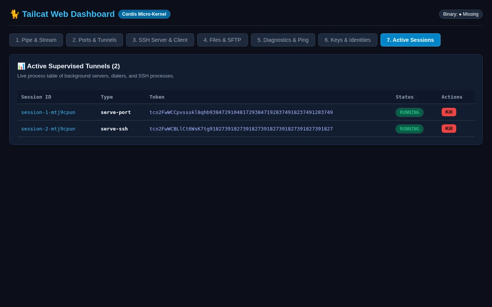

# Tailcat Web Dashboard Visual Documentation

Comprehensive visual guide for all 7 modules in the **[Cordis](https://github.com/cordiverse/cordis)-powered Tailcat Web Dashboard**.

---

## 🏗️ Web Dashboard & Cordis Plugin Architecture

> **Interactive Archify Visualizer**: [`docs/features/core/diagrams/web-arch.html`](../features/core/diagrams/web-arch.html) · [🌐 Live HTMLPreview](https://htmlpreview.github.io/?https://github.com/abdshomad/tailcat-tui-with-opentui/blob/main/docs/features/core/diagrams/web-arch.html)  
> **Unified System Architecture**: [`docs/features/core/diagrams/tui-web-arch.html`](../features/core/diagrams/tui-web-arch.html) · [🌐 Live HTMLPreview](https://htmlpreview.github.io/?https://github.com/abdshomad/tailcat-tui-with-opentui/blob/main/docs/features/core/diagrams/tui-web-arch.html)



### 1. HTTP Server & Endpoints
* **Dashboard Interface**: Served as responsive HTML with dark-mode styling and tab navigation for modules `pipe`, `ports`, `ssh`, `files`, `diag`, `keys`, and `sessions`.
* **REST API (`/api/sessions`)**: Returns live JSON serialization of all background tunnel sessions supervised by `TailcatService`.
* **Dynamic Plugin Lifecycle**: Can be dynamically enabled or disposed from OpenTUI Tab 8 ("Settings & Plugin Manager") via `ctx.pluginManager.togglePlugin('webServer')`.
* **Port Allocation**: Automatic sequential scanning (`PortScanner.resolvePort(3840, true)`) finding available ports starting from `3840`.

---

## 📋 Modules Overview

| Module # | Module Name | Route | Documentation | Screenshot |
| :---: | :--- | :---: | :--- | :---: |
| **01** | Pipe & Raw Stream | `/?tab=pipe` | [Pipe & Raw Stream](./01-pipe.md) |  |
| **02** | Ports & Tunnels | `/?tab=ports` | [Ports & Tunnels](./02-ports.md) |  |
| **03** | Auth-Free SSH Server | `/?tab=ssh` | [Auth-Free SSH Server](./03-ssh.md) |  |
| **04** | Files & Drop Box Inbox | `/?tab=files` | [Files & Drop Box Inbox](./04-files.md) |  |
| **05** | Network Diagnostics & Ping | `/?tab=diag` | [Network Diagnostics & Ping](./05-diagnostics.md) |  |
| **06** | Key Management & Identities | `/?tab=keys` | [Key Management & Identities](./06-keys.md) |  |
| **07** | Active Sessions & Process Supervisor | `/?tab=sessions` | [Active Sessions & Process Supervisor](./07-sessions.md) |  |

---

## 🧪 Testing & Execution

```bash
# Run Web Plugin and Plugin Manager unit tests
npm test -- tests/web-serving.test.mjs tests/plugins.test.mjs

# Re-generate all Web Dashboard screenshots and Markdown pages
npm run test:screenshots
```
